# Adding Doppl to an Existing Android Project

It is entirely possible that your organization is interested in shipping a party
clicker app. If so, our [tutorial](./Tutorial) has you covered!

It is more likely, though, that you have some app that you wrote for Android
that you want to support on iOS.

In this tutorial, we will walk through the steps of taking an existing
Android project, adding Doppl to it, and getting the results to work on iOS.

## Prerequisites

If you have already gone through the [basic tutorial](./Tutorial), you should be in
fine shape for following along with this tutorial. If, on the other hand, you
skipped the original tutorial, you have a bit of prep work to do.

### Tools

This tutorial is designed around Android Studio 3.0 and Xcode 9. Ideally, you are
working with those versions of those IDEs. If not, you may need to slightly
adapt the instructions to fit your particular IDE versions.

This tutorial also assumes that you are doing all of your development work
on macOS. 

### Download the Doppl Runtime

Visit [the download page](http://doppl.co/download.html) and download the latest
Doppl runtime. Note that this is a rather large ZIP file (over 1GB), so plan
accordingly.

Then, unZIP its contents into some new directory somewhere on your development
machine. The exact location does not matter, but you will need to enter its
path into a couple of spots (e.g., a `local.properties`) file.

### Configure Xcode for Doppl

We need to teach Xcode about Doppl. This is a one-time thing, configuring
the IDE &mdash; we do not need to do this work for each Android project that
we are trying to convert to iOS.

Go to Xcode > Preferences > Locations, then click on Custom Paths. There,
add a new custom path via the + button, with the following values:

- Name = `J2OBJC_LOCAL_PATH`
- Display Name = `J2OBJC_LOCAL_PATH`
- Path = `...`

(where `...` is replaced by the fully-qualified path to the Doppl runtime
directory on this machine)


<iframe width="560" height="315" src="https://www.youtube.com/embed/swLXzvIOm9A" frameborder="0" allowfullscreen></iframe>

### Install CocoaPods

In addition, you
need to install [Cocoapods](https://cocoapods.org/), if you have not done so
already for other reasons. Doppl generates a pair of pods from your Android
app: one containing the main code, the other containing the test code.

Aim to keep your Cocoapods version up to date. These instructions work with
version 1.3.1.

## Step #1: Clone the Starter Android Project

Clone or download [the 1.0.2 tagged edition](https://github.com/doppllib/SOAndroid/tree/v1.0.2)
of the starter project
&mdash; `SOAndroid` &mdash; from
[its GitHub repository](https://github.com/doppllib/SOAndroid).

You should be able to import this into Android Studio 3.0+ and run it on an
Android device or emulator that has Internet access. It will show the latest
15 questions from the `android` tag on Stack Overflow:

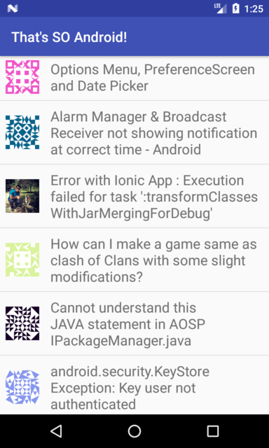

It also has a unit test with a single test case, to confirm that we can
successfully retrieve data from the Stack Exchange API.

## Step #2: Add local.properties

If you imported the starter project into Android Studio, you should see
a `local.properties` file in the project root directory. If not, add one.

In there, add a `j2objc.home` property, whose value is the fully-qualified path to
where you set up the Doppl runtime:

```groovy
j2objc.home=...
```

(where the `...` is replaced by your path to the Doppl directory)

Here, `j2objc` refers to
[Google's Java-to-Objective-C translator](https://developers.google.com/j2objc/),
which is a key part of the Doppl environment.

<iframe width="560" height="315" src="https://www.youtube.com/embed/H95OKwQ_9FU" frameborder="0" allowfullscreen></iframe>

## Step #3: Add the Repositories

Doppl has a Gradle plugin and some runtime dependencies that are hosted in a
custom Maven repository. We need to configure Gradle in our project to refer to
that repository.

Open the `build.gradle` file in the project root directory. In there,
add the following line to both `repositories` closures:

```groovy
maven { url 'https://dl.bintray.com/doppllib/maven2' }
```

This will give you something akin to:

```groovy
// Top-level build file where you can add configuration options common to all sub-projects/modules.

buildscript {
  repositories {
    jcenter()
    google()
    maven { url 'https://dl.bintray.com/doppllib/maven2' }
  }
  dependencies {
    classpath 'com.android.tools.build:gradle:3.0.1'
  }
}

allprojects {
  repositories {
    jcenter()
    google()
    maven { url 'https://dl.bintray.com/doppllib/maven2' }
  }
}

task clean(type: Delete) {
  delete rootProject.buildDir
}
```

Since we are going to be making more Gradle modifications, you are welcome to skip
syncing the project files with Gradle right now. In other words, ignore the yellow
banner that asks you to "Sync Now".

## Step #4: Add the Plugin

Given that Gradle now knows where to get the plugin, we can add the plugin to
the project.

In the `build.gradle` file in the project root &mdash; the one that you just
edited &mdash; add the following line to the `dependencies` closure in the
`buildscript` closure:

```groovy
classpath 'co.doppl:gradle:0.10.5'
```

This should give you something like:

```groovy
// Top-level build file where you can add configuration options common to all sub-projects/modules.

buildscript {
  repositories {
    jcenter()
    google()
    maven { url 'https://dl.bintray.com/doppllib/maven2' }
  }
  dependencies {
    classpath 'com.android.tools.build:gradle:3.0.1'
    classpath 'co.doppl:gradle:0.10.7'
  }
}

allprojects {
  repositories {
    jcenter()
    google()
    maven { url 'https://dl.bintray.com/doppllib/maven2' }
  }
} 

task clean(type: Delete) {
  delete rootProject.buildDir
}
```

Then, open the `build.gradle` file in the `app/` module. At the top, below
the existing `apply plugin: 'com.android.application'` line, add
`apply plugin: 'co.doppl.gradle'`.

As before, since we are going to be making more Gradle modifications, you are
welcome to skip syncing the project files with Gradle right now.

## Step #5: Configure Doppl

Doppl, on its own, usually needs some amount of configuration to determine
what to convert and how to convert it. That is accomplished via a
`dopplConfig` closure, as a peer of the `android` closure in a module's
`build.gradle` file.

In the `app/` module's `build.gradle` file &mdash; the one to which you added
the `apply plugin: 'co.doppl.gradle'` line in the preceding step &mdash;
add this `dopplConfig` closure at the bottom:

```groovy
dopplConfig {
  translatePattern {
    include 'co/doppl/so/api/**'
    include 'co/doppl/so/arch/**'
    include 'co/doppl/so/RepositoryTest.java'
  }

  javaDebug true

  translatedPathPrefix 'co.doppl.so.api', 'SOAPI'
  translatedPathPrefix 'co.doppl.so.arch', 'SOA'

  testIdentifier {
    include 'co/doppl/so/RepositoryTest.java'
  }
}
```

This tells Doppl to:

- Convert the classes in our `co.doppl.so.api` and `co.doppl.so.arch` packages,
along with the `co.doppl.so.RepositoryTest` class.

- Add line directives in the Objective-C code to tie it to the Java code that it came
from. This way, when we use breakpoints in Xcode and step through our code, and when
we encounter converted Objective-C code, the debugger will show us stepping 
through the Java code, as that is easier to read.

- When generating Objective-C files, use certain prefixes for the different
Java package names.

- Mark the `co.doppl.so.RepositoryTest` class as being a unit test class
that should be in the test output, not the production output, from the Doppl
conversion process.

Some notes about this:

- The `MainActivity` class is not converted, as that is our Android
UI, and we will want to create a native iOS UI instead.

- `translatePathPrefix` requires a match on the entire Java package name.
For example, `translatedPathPrefix 'co.doppl', 'D'` would not match
any classes, as there are no classes in this project *directly* in the
`co.doppl` package.

- The default `testIdentifier` will find any classes whose name ends in
`Test.java` and assume that they represent unit tests. In this case,
that happens to fit our situation (`RepositoryTest.java` ends in
`Test.java`), and so the `testIdentifier` closure shown above is superfluous.
It is there for illustration purposes, as for many projects, developers
will have chosen other names for their test classes.

## Step #6: Define Doppl Dependencies

The Doppl conversion process converts Java source code, not compiled Java
bytecode or Dalvik bytecode. As a result, we need to provide Doppl with
Doppl-specific alternatives to libraries that are used by the Java classes
that are being converted.

To that end, make the following modifications to the `build.gradle` file in the
`app/` module.

### Add Some Constants

You should see a block of constants for some version numbers that are used
for multiple artifacts:

```groovy
def supportVersion = "26.1.0"
def archVer = "1.0.0-rc1"
def retroVer = "2.3.0"
```

Add these two to that block:

```groovy
def dopplArchVer = "1.0.0.2-rc1"
def dopplRetroVer = "2.3.0.10"
```

### Add Some doppl Statements

Then, replace the existing `dependencies` closure with the following:

```groovy
dependencies {
  implementation      "com.android.support.constraint:constraint-layout:1.0.2"
  implementation      "com.android.support:recyclerview-v7:$supportVersion"
  implementation("com.android.support:support-v4:$supportVersion") {
    exclude group: 'com.android.support', module: 'support-media-compat'
  } // for https://issuetracker.google.com/issues/64909326
  implementation      "com.squareup.picasso:picasso:2.5.2"

  implementation      "io.reactivex.rxjava2:rxjava:2.1.5"
  doppl               "co.doppl.io.reactivex.rxjava2:rxjava:2.1.5.2"
  implementation      "io.reactivex.rxjava2:rxandroid:2.0.1"
  doppl               "co.doppl.io.reactivex.rxjava2:rxandroid:2.0.1.7"

  implementation      "com.squareup.retrofit2:retrofit:$retroVer"
  implementation      "com.squareup.retrofit2:converter-gson:$retroVer"
  implementation      "com.squareup.retrofit2:adapter-rxjava2:$retroVer"
  doppl               "co.doppl.com.squareup.retrofit2.urlsession:retrofit:$dopplRetroVer"
  doppl               "co.doppl.com.squareup.retrofit2.urlsession:converter-gson:$dopplRetroVer"
  doppl               "co.doppl.com.squareup.retrofit2.urlsession:adapter-rxjava2:$dopplRetroVer"

  implementation      "android.arch.lifecycle:runtime:1.0.3"
  doppl               "co.doppl.android.arch.lifecycle:runtime:$dopplArchVer"
  implementation      "android.arch.lifecycle:extensions:$archVer"
  doppl               "co.doppl.android.arch.lifecycle:extensions:$dopplArchVer"

  testImplementation  "junit:junit:4.12"
  testDoppl           "co.doppl.junit:junit:4.12.0"
  testImplementation  "org.mockito:mockito-core:1.9.5"
  testDoppl           "co.doppl.org.mockito:mockito-core:1.9.5.0"
  testImplementation  "co.doppl.lib:androidbasetest:0.8.8"
  testDoppl           "co.doppl.lib:androidbasetest:0.8.8.0"
}
```

The first few lines are for libraries tied to our UI, such as `recyclerview-v7`.
Our code that is being converted to Objective-C does not refer to those libraries,
so we do not need to make any changes there.

For our RxJava, RxAndroid, Retrofit, and Architecture Components dependencies,
we need to add `doppl` lines to tell Doppl what [pre-converted libraries](./Libraries)
we should use. Technically, there is nothing magic about having the `doppl`
statements alongside their `compile` equivalents, but keeping them together
helps us ensure that we have added all the necessary `doppl` statements.
In many cases, there is a 1:1 mapping between the `compile` statement
and the corresponding `doppl` statement.

Similarly, we need to pull in JUnit and Mockito for our tests. That requires
pairs of dependencies, with `testImplementation` for the dependency to use
for native Java testing and `testDoppl` for the dependency to use on iOS.

The pair of `co.doppl.lib:androidbasetest` dependencies provide the rest of the framework
to allow us to build and run our JUnit-based tests on iOS. The
documentation on [testing with Doppl](https://github.com/doppllib/doppllib.github.io/blob/master/docs/Testing.md#tests-and-testdoppl)
has more details on this setup.

Now, allow Android Studio to sync the project with the Gradle build files, since
Android Studio has been pestering you for the past few steps to go do that.

## Step #7: Create the Xcode Projects

You now need to create *two* Xcode projects: one for the app, and one for
the tests. Technically, these can reside anywhere, but it is a bit simpler if they
are part of the overall project. So, in this tutorial, you will create `iosApp/`
and `iosTest/` projects off of the main project root directory.

To create `iosApp`:

- Start Xcode.

- If you come up to the welcome dialog, choose "Create a new Xcode project"
(see below screenshot). If you were already in one Xcode project, choose
File > New > Project... from the main menu.


- In the template selection pane of the new-project wizard, choose
"Single View App". Then click Next.


- In the project options pane of the new-project wizard, fill in `iosApp`
for the "Product Name". Choose Swift as the programming language.
Fill in the rest of the fields as you see fit, for
whatever you want for your project. Then, click Next.

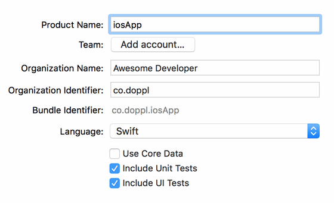

- In the Finder-style directory-picker dialog that appears, choose your
Android Studio project's root directory, make sure that the "Create Git repository"
checkbox is unchecked, then click OK to close the dialog.

After several seconds of churning, you should then be taken to an empty
Xcode project window.

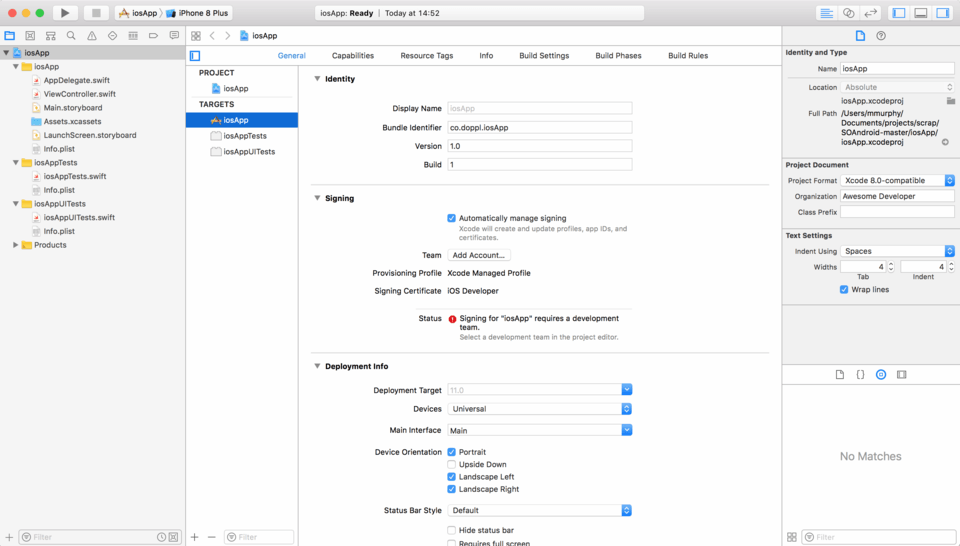

At this point, choose File > Close Project from the main menu,
to close up that IDE window.

Then, repeat these steps, but using `iosTest` instead of `iosApp` as the product
name. You can use File > New > Project... from the main menu to start creating the
`iosTest` project.

## Step #8: Define the Podfiles

Open up your favorite text editor. Then, take the following content and put
it in a file named `Podfile` in the `iosApp/` directory that you created
in the previous step:

```ruby
platform :ios, '9.0'

install! 'cocoapods', :deterministic_uuids => false

target 'iosApp' do
    use_frameworks!
    pod 'doppllib', :path => '../app'
end
```

Here, 'iosApp' is the name of our newly-created Xcode project, and `:path`
points to the `app/build/` directory of the Android Studio project, relative
to the `iosApp/` directory. If you elected to put `iosApp/` somewhere else, you
will need to adjust the `:path` value to the proper relative path.

Then, create another `Podfile`, this time in `iosTest/`, where the `target`
is `iosTest`:

```ruby
platform :ios, '9.0'

install! 'cocoapods', :deterministic_uuids => false

target 'iosTest' do
    use_frameworks!
    pod 'testdoppllib', :path => '../app'
end
```

## Step #9: Generate the Pods

Now, you can run the `dopplBuild` Gradle task.

From inside of Android Studio, you will find the `dopplBuild` task in the
Gradle tool, in the `doppl` category under the project root:

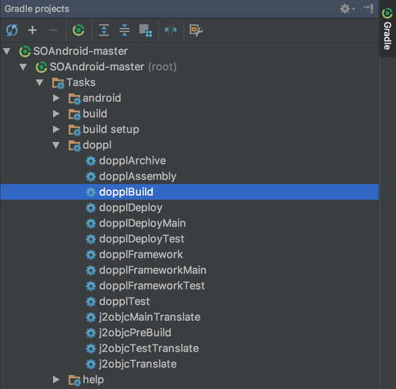

Double-click on that entry to run the task:

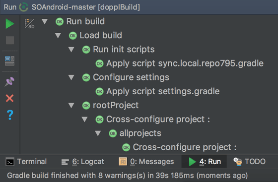

If you prefer, run the `dopplBuild` task from the command line, from the
project root directory, using `gradle` (if you have a compatible version
of Gradle installed) or `./gradlew` (if you prefer to use the Gradle Wrapper).

When that is completed, in a terminal window, navigate to the `iosApp/`
directory and run `pod install`. This will complete the process of creating
the pods for this workspace. Then, navigate to the `iosTest/` directory
and run `pod install` there as well.

## Step #10: Build the Pods

Double-click on the `iosApp.xcworkspace` file in your `iosApp/` project or otherwise
arrange to open it in Xcode. Once there, run the project. While this will not
generate much useful output in the iOS Simulator, it will compile the pod that
we defined in the preceding step. You will know when it is done when the number
of build errors stops climbing, as there is no other obvious signal given by
Xcode. In particular, a "Build Succeeded" popup will appear shortly before
the build has actually completed.

Then, repeat this process with the `iosTest.xcworkspace` file in the `iosTest/` project.

## Step #11: Copy Generated Test Files Into XCode

If you look at `app/build/`, you will find two files of note:

- `dopplTests.txt`, which lists the JUnit test classes that we specified via
`testIdentifier` in `dopplConfig`

- `prefix.properties`, which lists the items we defined in `translatePathPrefix`
statements in `dopplConfig`

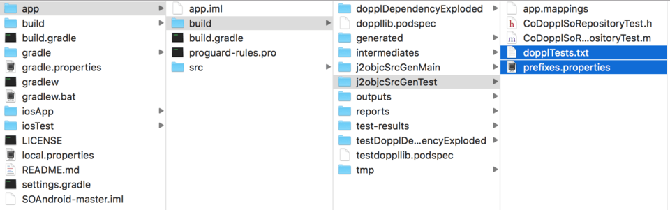

Copy both of these into your `iosTest/` workspace, to have them be alongside
your other files in `iosTest/` (e.g., peers of `AppDelegate.swift` and
`ViewController.swift`):

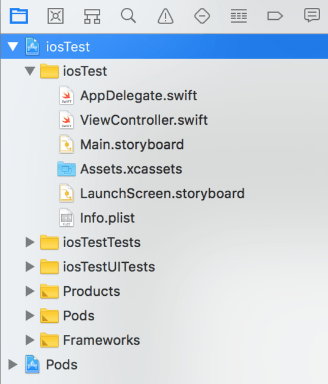

When you drag the files from the Finder into Xcode, a popup will appear for
you to configure the copy operation:

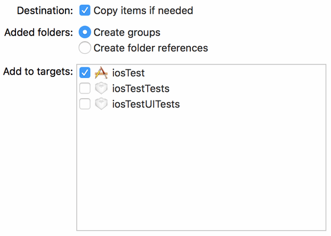

Choose "Copy items if needed", and ensure that "Add to targets" has `iosTest`
checked. Click Finish to actually perform the copy:

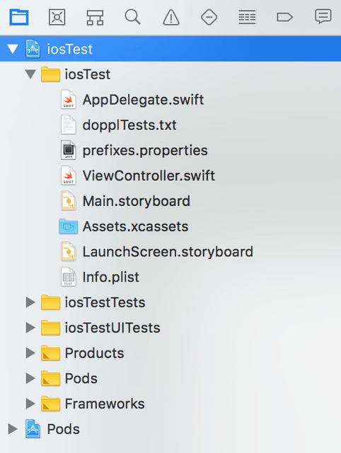

## Step #12: Write a Test Scaffold

While we now have our test code in our `iosTest/` project, we do not have anything
that will run those tests when we run the project. So, let's add those items.

### `AppDelegate`

Click on `AppDelegate.swift` and:

- Add `import testdoppllib` to the list of imports, and

- Add `DopplRuntime.start()` to `application()`

This should give you something resembling this:

```objc
import UIKit
import testdoppllib

@UIApplicationMain
class AppDelegate: UIResponder, UIApplicationDelegate {

    var window: UIWindow?


    func application(_ application: UIApplication, didFinishLaunchingWithOptions launchOptions: [UIApplicationLaunchOptionsKey: Any]?) -> Bool {
        DopplRuntime.start()
        return true
    }

    func applicationWillResignActive(_ application: UIApplication) {
        // Sent when the application is about to move from active to inactive state. This can occur for certain types of temporary interruptions (such as an incoming phone call or SMS message) or when the user quits the application and it begins the transition to the background state.
        // Use this method to pause ongoing tasks, disable timers, and invalidate graphics rendering callbacks. Games should use this method to pause the game.
    }

    func applicationDidEnterBackground(_ application: UIApplication) {
        // Use this method to release shared resources, save user data, invalidate timers, and store enough application state information to restore your application to its current state in case it is terminated later.
        // If your application supports background execution, this method is called instead of applicationWillTerminate: when the user quits.
    }

    func applicationWillEnterForeground(_ application: UIApplication) {
        // Called as part of the transition from the background to the active state; here you can undo many of the changes made on entering the background.
    }

    func applicationDidBecomeActive(_ application: UIApplication) {
        // Restart any tasks that were paused (or not yet started) while the application was inactive. If the application was previously in the background, optionally refresh the user interface.
    }

    func applicationWillTerminate(_ application: UIApplication) {
        // Called when the application is about to terminate. Save data if appropriate. See also applicationDidEnterBackground:.
    }


}
```

### `ViewController`

Click on `ViewController.swift`, and:

- Add `import testdoppllib` to the list of imports, and

- Add `CoTouchlabDopplTestingDopplJunitTestHelper.runResource(with: "dopplTests.txt")` to
`viewDidLoad()`, after the call to `super.viewDidLoad()`:

```objc
override func viewDidLoad() {
  super.viewDidLoad()
  CoTouchlabDopplTestingDopplJunitTestHelper.runResource(with: "dopplTests.txt")
}
```

## Step #13: Run the iOS Tests

At this point, make sure that the Console area of Xcode is open:

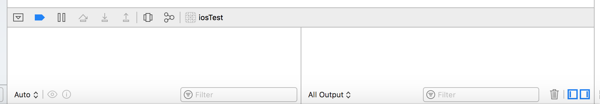

If it is not, open it via View > Debug Area > Activate Console from the
main menu.

Then, if you click the Run button in Xcode, the IDE will build and
run the test suite. The build process will take a while and give you several
thousand warnings, most of which come from the way that J2ObjC generates the
Objective-C code. When the tests are complete, the JUnit test runner will
show the test results in the console, and you should see that all tests pass:

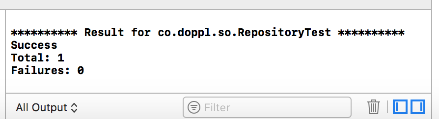

## Step #14: Copy Generated App File Into XCode

Copy `prefix.properties` from `app/build/` into your `iosApp/` workspace, to have it be alongside your other
files in `iosApp/` (e.g., peers of `AppDelegate.swift` and
`ViewController.swift`), much as we did back in Step #11. However, this time,
we are only copying this one file, as we do not need `dopplTests.txt`.

## Step #15: Access the Generated Code From Swift

Most likely, your job is to ship an app with a user interface, not just
a working test suite. For that, you will need to be able to access the
generated code from your Swift files in `iosApp`, so that you can obtain
the model data loaded from the network. From there, you can craft a UI to
display that data.

Here, we will focus on just getting you access to the model data via the
view-model. Creating a suitable iOS UI that uses this data is left as an exercise
for the reader.

### `AppDelegate`

In the `iosApp` project, click on `AppDelegate.swift` and

- Add `import doppllib` to the list of imports
- Add `DopplRuntime.start()` to `application()`

This should give you something like this:

```swift
import UIKit
import doppllib

@UIApplicationMain
class AppDelegate: UIResponder, UIApplicationDelegate {

    var window: UIWindow?


    func application(_ application: UIApplication, didFinishLaunchingWithOptions launchOptions: [UIApplicationLaunchOptionsKey: Any]?) -> Bool {
        // Override point for customization after application launch.
        DopplRuntime.start()
        return true
    }

    func applicationWillResignActive(_ application: UIApplication) {
        // Sent when the application is about to move from active to inactive state. This can occur for certain types of temporary interruptions (such as an incoming phone call or SMS message) or when the user quits the application and it begins the transition to the background state.
        // Use this method to pause ongoing tasks, disable timers, and invalidate graphics rendering callbacks. Games should use this method to pause the game.
    }

    func applicationDidEnterBackground(_ application: UIApplication) {
        // Use this method to release shared resources, save user data, invalidate timers, and store enough application state information to restore your application to its current state in case it is terminated later.
        // If your application supports background execution, this method is called instead of applicationWillTerminate: when the user quits.
    }

    func applicationWillEnterForeground(_ application: UIApplication) {
        // Called as part of the transition from the background to the active state; here you can undo many of the changes made on entering the background.
    }

    func applicationDidBecomeActive(_ application: UIApplication) {
        // Restart any tasks that were paused (or not yet started) while the application was inactive. If the application was previously in the background, optionally refresh the user interface.
    }

    func applicationWillTerminate(_ application: UIApplication) {
        // Called when the application is about to terminate. Save data if appropriate. See also applicationDidEnterBackground:.
    }


}
```

This is the same basic process as what we did in the `iosTest` project, except
there we use `testdopplib` instead of `doppllib`.

### ViewController

Then, click on `ViewController.swift` and

- Add `import doppllib` to the list of imports
- Add the following to `viewDidLoad()`

```swift
let viewModel = SOAQuestionsViewModel()!
viewModel.register__(with: self)
```

Now you have access to the `QuestionsViewModel` that was translated from Java.
However, you should also get an error because `ViewController` does not
implement the `SOAQuestionsViewModel_Host` protocol.

- Implement `SOAQuestionsViewModel_Host` and the `setQuestionsWith()` method.

In the end, you should have something that looks like this:

```swift
import UIKit
import doppllib

class ViewController: UIViewController, SOAQuestionsViewModel_Host {
    
    func setQuestionsWith(_ questions: JavaUtilList!) {
        
    }

    override func viewDidLoad() {
        super.viewDidLoad()
        // Do any additional setup after loading the view, typically from a nib.
        
        let viewModel = SOAQuestionsViewModel()!
        viewModel.register__(with: self)
        
    }
}
```

When compiled, types used in Java generics are erased, so when translated to
Objective-C we are left with a generic `JavaUtilList`. In order to use
`questions` in a normal way, we would prefer to have an array of `SOAQuestion`
(`[SOAQuestion]`). To do so, create a new file called `JavaUtils.swift` and
paste the code below.

```swift
import Foundation
import doppllib

class JavaUtils {    
    static func javaList(toList list: JavaUtilList) -> [Any] {
        var array = [Any]()
        for i in 0..<list.size() {
            array.append(list.getWith(i))
        }
        return array
    }
}
```

To keep it generic, `javaList` returns an array of `Any`, that we will cast.
Using this static function in the `setQuestionsWith()` method, we can retrieve
the `SOAQuestion` array and set it to a variable. Your `ViewController` should
look something like this now. 

```swift
import UIKit
import doppllib

class ViewController: UIViewController, SOAQuestionsViewModel_Host {
    
    private var questions = [SOAQuestion]()

    func setQuestionsWith(_ questions: JavaUtilList!) {
        self.questions = (JavaUtils.javaList(toList: questions) as? [SOAQuestion])!
    }

    override func viewDidLoad() {
        super.viewDidLoad()
        // Do any additional setup after loading the view, typically from a nib.
        
        let viewModel = SOAQuestionsViewModel()!
        viewModel.register__(with: self)
    }
}
```

## Addendum: Making Changes

If you want to make changes to the Android app or its tests, you are welcome
to do so.

If your change does not involve adding, removing, or renaming any classes,
all that you need to do is run the `dopplBuild` task again on your iOS development
machine, or run that task on another machine and copy the build results to your
iOS development machine. When you open Xcode again onto the relevant workspace,
your changes will be available.

If, on the other hand, you add, remove, or rename a class, after running
`dopplBuild` and getting the results onto your iOS development machine, you
also need to run `pod update` from the `iosApp/` and/or `iosTest/` directory
(whichever one(s) are affected by your changes). When you open Xcode again
onto the relevant workspace(s), these more substantial changes will be available.
