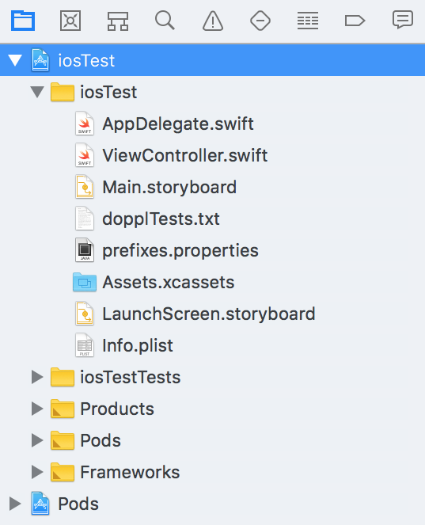
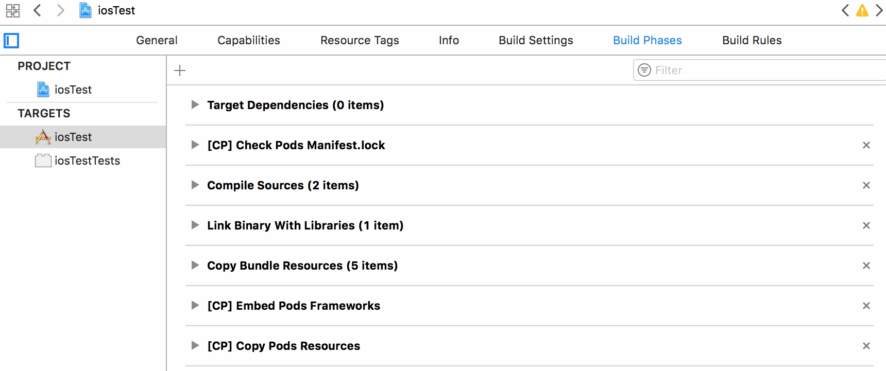

# Dealing with Doppl Challenges

The mechanics of setting up Doppl are fairly easy. For simple scenarios,
getting your code to work with Doppl is nearly automatic.

However, most likely, your scenarios are not always simple.

The more complex your app is, the more likely it is that you will run into
some challenges, either in converting the Java code using Doppl, or making
use of that converted code effectively to build an iOS UI. Fortunately,
for many of these challenges, we have some recommendations to help you overcome
them.

## Simplify Your UI API

While J2objc generates valid Objective-C code, that code is not always very
pretty. Complex Java code becomes even more complex when converted to Objective-C.

However, you will not be touching most of that Objective-C code, any more than
you touch the Dalvik bytecodes that go into the Android APK. The Objective-C
code is merely an output of the build process that goes into your iOS app.

What you *will* touch, though, is the API between your UI code and the code
that Doppl and J2objc is converting for you. You will write a custom iOS UI, to
provide the best UX for your iOS users, and that UI code will need to call
into the Objective-C rendition of the rest of your app code. The simpler
that API is, the easier your iOS development will be.

For example, you might be consuming an RxJava stream in your existing Android
UI code, either directly or by converting it into `LiveData` to get
lifecycle awareness. That RxJava stream might come from a repository and be
managed by some sort of view-model. This approach works, and J2objc will
faithfully provide an Objective-C conversion of the RxJava stream. However,
while RxJava seems to have a lean Java API, in reality, it is a fairly
elaborate Java API... just one that happens to result in something that requires
minimal Java code to consume. The Objective-C conversion of that RxJava stream
results in a fairly messy API that you would have to use from Objective-C or
Swift in the iOS UI code.

Instead, hide the streams via some simpler API, such as having the view-model
define an interface that the UI code implements to pass in model changes
as they arrive. Keep the RxJava logic inside the to-be-converted code, so that
your UI code can deal with simpler methods on simpler classes, both in the
Android UI and in the iOS UI.

## Lose the Android Resources

Most Android resources are tied to the UI and therefore would fall outside
of Doppl's responsibility. However, occasionally, non-UI code may want data
from resources, such as using string resources for Web service URLs. Doppl
does not convert Android resources, nor does the `Context` implementation
supplied by Doppl provide access to resources. As a result, you need to find
some way of getting this data that does not directly involve an Android resource.

Options include:

- Switch from resources to `BuildConfig` values, populated via `buildConfigField`
in your `build.gradle` file

- Consider the data to be input supplied by an Android component that is
calling directly into your to-be-converted code (e.g., an activity or service)

- Consider the data to be input supplied via some form of dependency injection

- Hard-code the values, whether as a stop-gap measure or as the long-term
approach

## Mock, But Don't Spy

Most testing libraries that you will use fall into two categories:

- Those that Doppl [has converted for you](./Libraries)

- Those that [you have to convert yourself](./DopplLibrary)

Mockito is different, as some Mockito functionality is "baked into" J2objc,
which in turn is used by Doppl. This has the advantage of being automatic &mdash;
there is nothing that you need to add to a `build.gradle` file to allow your
Mockito tests to work on iOS. Just have the `testImplementation` statement to
pull in Mockito for use on Android, and you are set.

However, this approach is also inflexible, to some degree. J2objc does not
update its Mockito copy very frequently &mdash; at the present time, it uses
`1.9.5`, and you will want to use that same version on the Android side.

Also, J2objc's Mockito support is incomplete. It supports mocking objects, but
not spying them using `spy()`. If you have tests that employ `spy()`, those
tests will not work on iOS.

## Dealing with Reference Counting

Android developers are used to Java, which offers automatic garbage collection.
Once an object no longer has any strong references to it (e.g., `static` fields),
it becomes eligible for garbage collection. Java developers "merely" need to
ensure that they do not have lingering strong references to objects to avoid
memory leaks. And, as many Java developers will tell you, this is difficult enough
to manage.

Objective-C does not offer garbage collection by default. Instead, it uses
[reference counting](https://developers.google.com/j2objc/guides/memory-management),
which is akin to C's `malloc()` and `free()`, just with a fresh coat of paint.
By default, objects need to *explicitly* tell the runtime when it wishes to retain
and release some other object. Once an object is fully released, its memory can be
reclaimed. This avoids the garbage collection overhead that plagued Android's
early versions, but it greatly increases the likelihood of memory leaks:
the more developers have to do manually, the more likely it is that those developers
will screw it up somehow.

J2objc will generate the retain-and-release code for you, giving the impression
that your Java code still uses garbage collection. Most of the time, this works
fine. It breaks down when there is a "cycle" of connected objects: A has a reference
to B, which has a reference to C, which has a reference back to A. Dalvik's and
ART's garbage collectors in Android can detect these cycles; Objective-C's
reference counting cannot, even with J2objc's assistance. As a result, it
is possible for valid Java code to be converted into leaky Objective-C code.

Standard iOS development tools (e.g., "Cycle Finder") can help track down these
leaks. As you are examining your object models, though, you can help your cause
by trying to identify where these cycles might exist and reorganize your objects
to break the cycle.

## Dealing with Java Resources

Android resources are rarely needed by Doppl-converted code, as resources
mostly tie into the UI, and that code is what you will want to replace with
an iOS equivalent, not convert with Doppl.

Android *apps* rarely use the older form of Java resources, typically found
in a `resources/` directory as a peer of `src/`. However, you will find the
occasional library or test suite that uses those, particularly where the library
is a plain Java JAR and is designed to work in other environments beyond Android.

Your converted Java code that attempts to read in those resources will work, 
but you need to copy over the resources into your iOS project manually. To do
this, in Xcode:

- Choose the app target (i.e., the root of the folder tree)

- Click on Build Phases

- Expand "Copy Bundle Resources"

- Drag files into the "bundle resources" list from the Finder

## Running Fewer Tests

Usually, we want to run all of our tests, to confirm that our code works.
Sometimes, when debugging a specific test, we would like to run just that
individual test.

To do this, temporarily comment out the
`CoTouchlabDopplTestingDopplJunitTestHelper.runResource(with: "dopplTests.txt")`
line in `ViewController.swift` and replace it with a call to
`runSpecificWithNSString()` on `CoTouchlabDopplTestingDopplJunitTestHelper`.
`runSpecificWithNSString()` takes an `NSString` parameter that either:

- is the fully-qualified name of the Java class whose tests should be run, or

- is the name of the class plus the specific test method that should
be run (e.g., "com.example.app.AwesomeTest#somethingCool")

When you are ready to return to running your entire test suite, remove
(or comment out) the `runSpecificWithNSString()` call and uncomment the
`runResource()` call.

## Library-Specific Concerns

Converting libraries to work with Doppl &mdash; particularly third-party
libraries &mdash; have additional challenges to be overcome.

### Do You Really Need That Library?

Converting libraries for use with Doppl apps takes time. Hence, one of the first
things that you should do is determine whether or not you *really* need any given
library that needs to be set up for Doppl. The fewer libraries you need to convert,
the less time that conversion takes.

Exacerbating this problem are transitive dependencies. You might think "oh, that's
just one library &mdash; how much work can that represent?". However, that
library depends upon other libraries, which depend upon yet other libraries,
and so on. What starts as one little library turns into a vast tree of libraries...
all of which would need to be converted.

Moreover, bear in mind that Doppl is performing a conversion of Java source code,
via J2objc. As a result, ProGuard does not enter the picture. In Android, you
might only use a small portion of some library, relying on ProGuard to jettison
the rest at build time. With Doppl, even if your app only uses a portion of the
library, you wind up having to deal with converting the entire library, including
those parts that you might never need.

Plus, there is the issue of long-term maintenance. Every time that you take
on a newer library edition, you will need to update (or possibly re-implement)
your Doppl conversion to match.

It may be simpler for you to switch libraries. If the Doppl project
is maintaining [a library with similar functionality](./Libraries), and you 
use it instead of some alternative, you do not have to worry about converting
the library for use with Doppl. There is some cost in switching to the new
library, but (hopefully) that is a one-time cost.

In some cases, particularly in test code, you might just "inline" some
routine that you might otherwise have pulled from a library. Normally, it is
nicer to use some debugged method from a well-known library, but if you are
only using that one method, frequently it will be simpler to re-implement the
method rather than maintain a Doppl edition of the whole library. For open
source libraries, you might be able to just copy in the desired code... though
do please honor the license terms, where relevant.

### Choosing an Artifact Repository

While `implementation`, `api`, and the legacy `compile` dependency directives
in Gradle support references to library modules via `project('...')` syntax,
`doppl` does not. Your Doppl-converted libraries have to be artifacts in a
repository somewhere.

This begs the question: where is "somewhere"?

You have many possibilities, with pros and cons to each:

- You could use `mavenLocal()`, which is a standard per-machine location
for artifacts. This is fairly easy to reference, but it requires each developer
to build the libraries to have their own local copy. Plus, you may be using
`mavenLocal()` for other things and do not want to add more stuff to it.

- You could use some other local Maven repository, either tied to a per-machine
location or as part of the overall project tree (e.g., have a `repository/` directory
off of the project root that contains your converted Doppl libraries). This
avoids any conflicts with other things in `mavenLocal()`, but it still requires
each developer to build all of the libraries, and it is a bit more complex to
set up.

- You could use some common reachable server that is still internal to your
organization, such as a file server that your development team already shares.
A Maven repository is "simply" a specific directory structure and expected
set of contents, and so while you can use commercial repository managers (e.g.,
Sonatype), that is not required. The benefit here is that everybody can share
the common repository; developers do not need to be able to build all of the
libraries themselves. On the other hand, somebody has to be responsible to set up
and maintain this repository. Plus, for a geographically-distributed workforce,
there may be challenges in finding a common accessible server that is still
private to your organization.

- You can use some public server, such as JCenter (which the Doppl team uses for
its shared Doppl-converted libraries). For open source libraries, this is fairly
straightforward to set up. However, now you may find yourself supporting other
developers besides your team, which may or may not be desired.

### Artifact Versioning

Your converted library will have a different group, just as do the official
Doppl libraries (e.g., `co.doppl.com.squareup.okhttp` versus
`com.squareup.okhttp`). Hence, you should not have any issue with your
artifact "colliding" with another one.

However, your artifact also needs version information. Ideally, this identifies
not only the version of the library that you started with but the version
of the Doppl conversion, in case you determine that the conversion needs more
work.

What the Doppl team does is add another version digit onto the end of the
semantic version of the library that was converted. For example,
`io.reactivex.rxjava2:rxjava:2.0.8` turned into 
`co.doppl.io.reactivex.rxjava2:rxjava:2.0.8.2`, and
`io.reactivex.rxjava2:rxjava:2.1.5` turned into 
`co.doppl.io.reactivex.rxjava2:rxjava:2.1.5.0`. The trailing digit represents
the version of the Doppl conversion, whereas the leading digits are the version
of the library used as the basis for that conversion.

### Version Control

If the library needs to be tweaked to make it more Doppl-friendly, you will want
to track such changes in version control.

For your own libraries, most likely you will make these changes just as part of
your normal development process. Those changes will roll into new library versions
as you see fit.

For third-party libraries, while you could contribute your changes back to the
library developers, there may be little interest on their part. This is
particularly true if your revisions break the API; the project maintainers may
not want to force everyone else to adapt just to provide a more Doppl-friendly
API. In this case, most likely, you will modify a fork of that library.

When forking a library, branch off of a specific version (via starting the
branch from a tag or a specific commit). Most likely, that version would be whatever
you are using already in the Android app. General branches like `master` are
"moving targets", making them less suitable for this sort of modification work.

### Non-Studio Project Structures

When converting third-party libraries, you may find that their projects are atypical,
from the standpoint of Android Studio. Some might lack Gradle build files,
as their project maintainers use Maven or some other build system. Some might
lack modules, with a `src/` directory directly off of the project root directory,
perhaps because the library was originally created using Eclipse.

Doppl requires Gradle, and so you will need to craft a Gradle build script that
can build the library. From there, you can adapt that build script to employ Doppl.

### Do You Test the Testing Libraries?

Libraries that your app needs can be divided into those that are used in your
production code and those that are used in your test code.

When you convert libraries that you are using in your production code, typically
you will want to also convert any unit tests that those libraries offer. That way,
you can use the unit tests to confirm that the conversion worked and did not introduce
some unexpected problems.

When you convert libraries that you are using in your test code, you could also
convert any unit tests for those libraries. However, this starts to get fairly 
down the path towards "diminishing returns" &mdash; do you really need to test the
testing libraries? After all, as noted above, every library that you convert
may result in a tree of additional libraries pulled in via transitive dependencies.
At some point, you have to weigh the costs with the benefits.

One place where you *will* want to convert those unit tests &mdash; no matter how
the library is used &mdash; is if you are planning on distributing the Doppl-converted
library to other parties. They may use that library in ways that you do not,
and so converting the unit tests helps you (and those other parties) feel confident
in the converted library.
