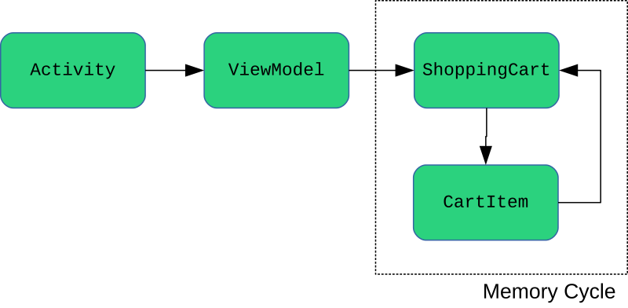

# Finding and Fixing Memory Cycles

One risk in using Doppl is introducing memory leaks.

Objective-C handles memory significantly differently than does Java. While
Google's J2ObjC tool handles some of the differences, it cannot handle all of
them automatically. As a result, code that may be perfect from a memory-management
standpoint on Android might result in leaks on iOS.

The culprit: memory cycles.

## What's a Cycle?

Suppose we have an `ShoppingCart` Java class:

```java
class ShoppingCart {
  List<CartItem> items;
  // other good stuff goes here
}
```

This, in turn, requires a `CartItem` Java class:

```java
class CartItem {
  ShoppingCart cart;
  // other good stuff goes here
}
```

This is a reasonably common pattern in Java development: parents holding children,
with children holding references back to the parent. And, in this case, this
represents a memory cycle: a `CartItem` is supposed to have a `cart` field
that points back to its `ShoppingCart`, which should have a reference to that
same `CartItem` in the `items` collection.

## Why Are Cycles Bad?

In Java, memory cycles are not a problem. The garbage collector is responsible
for identifying such cycles and taking them into account.

For example, suppose that we had a `ShoppingCart` and its `CartItems` in a
view-model of an Android activity. So, we have an activity referencing a view-model,
which references a `ShoppingCart`, which references its items, which hold references
back to the `ShoppingCart`.



Eventually, the user completes the work
of that activity, such as making the purchase. At that point, we no longer
need the `ShoppingCart` or its items. Once our activity is destroyed, the framework
will no longer have a reference to it, and so it becomes eligible for garbage collection.
If the only reference to the view-model was from that activity, that view-model
is also eligible for garbage collection.

However, the story is not quite as simple for the `ShoppingCart`. Even if the view-model
is eligible for garbage collection, there are also references to the cart from
its items. However, Java employs automatic garbage collection; in Android, this
means that Dalvik or ART will handle garbage collection without developer
involvement. It is the responsibility of the garbage collector to realize that
while the `ShoppingCart` and its items are a memory cycle, and while each of those
objects still has live references, there are no live references *to the cycle itself*,
once the view-model is eligible for garbage collection. Hence, the garbage collector
can collect the cart and items, once there are no live references to any of that,
which in this case means once the view-model itself can be garbage collected.

Objective-C does not work this way, because Objective-C does not have garbage
collection. Instead, by default, it uses "reference counting". This is a more
sophisticated approach to the classic allocate/free pattern seen in lower-level
languages like C and C++. It is the *developer's* responsibility to have code
to help the runtime keep track of how many outstanding references there are.
Once the reference count drops to zero, the runtime can release the memory associated
with the object. Done properly, this can avoid some of the pitfalls of memory
management on lower-level languages, such as code holding references to freed
memory blocks (and, worse, potentially still *using* those freed blocks). The
big advantage over a garbage-collected runtime environment is in terms of overhead:
we no longer need to have garbage collection code scanning our object space
and trying to clean stuff up.

However, manual reference counting is still manual. Not only is this prone to
developer mistakes, but it makes memory cycles a *developer* responsibility,
not a *runtime* responsibility. The developer needs to know when a memory cycle
is no longer needed and arrange to adjust the reference counts on everything in
the cycle. If you fail to do this, you can get a memory leak:

- If you decrement the reference count of a `ShoppingCart` but ignore the items,
the items' memory may never get reclaimed

- If you decrement the reference count of items, but ignore the cart, the cart's
memory may never get reclaimed

Google's J2ObjC, as part of its conversion of Java code to Objective-C, adds
in the reference counting logic where it can. Fortunately, it handles most of
this for us automatically. However, it cannot determine, automatically, how to
handle memory cycles, though it can help us identify where they may exist.

## Finding Candidate Cycles

J2ObjC provides [a cycle finder tool](https://developers.google.com/j2objc/guides/cycle-finder-tool)
to help identify candidate memory cycles. Doppl makes this available via
the `j2objcCycleFinder` Gradle task.

TODO put code from above into project, gather output, describe here

## Fixing Candidate Cycles

TODO

### Changing the Structure

TODO change inner class to nested

### WeakReferences

TODO

### Annotations

TODO

### Whitelisting

The key is that the cycle finder tool points out *candidate* memory cycles. It
is performing static code analysis; it has no way of knowing exactly what you
are doing at runtime. As a result, it might flag things that in theory could be
memory cycles but are not in practice.

Tree structures, for example, will show up as candidate memory cycles:

```java
class TreeNode {
  List<TreeNode> children;
  // other good stuff here
}
```

J2ObjC has to consider this a possible memory cycle, as it is possible that
a `TreeNode` might have itself in its own `children` collection. Or, node A
might have node B in its `children`, while node B might have node A in its
`children`. And so on.

TODO output from task

In practice, a true tree structure does not repeat nodes: a node will never appear
in the `children` of its descendants. It is entirely possible that a true memory
cycle would break other application logic, such as resulting in an infinite loop
or a `StackOverflowError` when trying to traverse the tree. So, in this case,
there may be nothing to fix. However, by default, the cycle finder will continue
reporting this problem.

To work around that, you can whitelist this case, to tell the cycle finder that
all is well and it should no longer report problems.

TODO work out syntax, test
