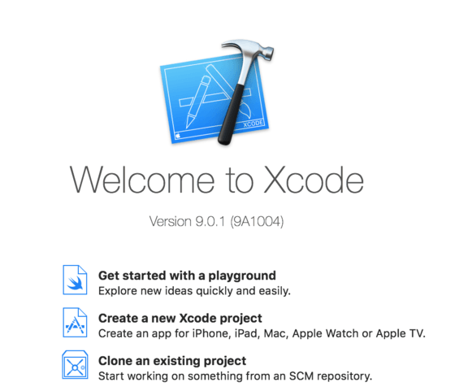
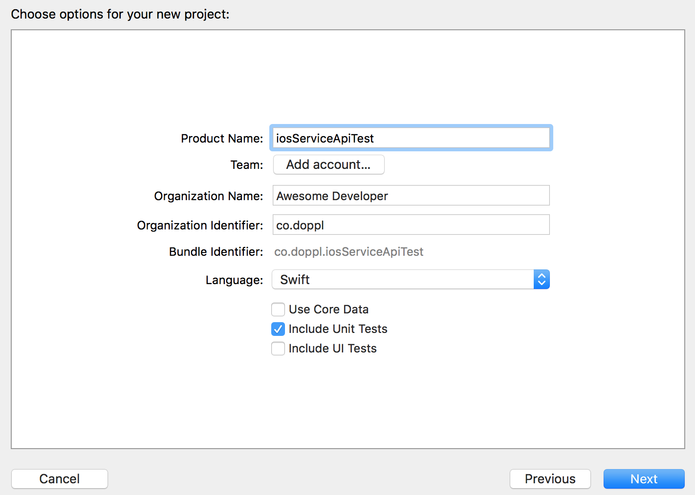
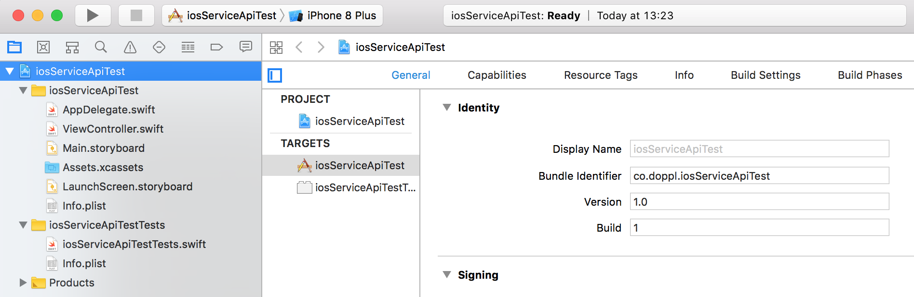

# Tutorial: Making a Doppl Library

Perhaps your app project is divided into a series of discrete library modules
consumed from an app module, such as to better support Instant Apps. Perhaps
your app project uses a third-party dependency &mdash; for production or for
testing &mdash; and that is not [a library that Doppl supports "out of the box"](./Libraries).

In those cases, you will need to make a Doppl library, as a
doppelgänger of the library module or third-party dependency.

In this tutorial, we will walk through converting a project that has both
an app module and a library module, where the app uses the library. Here, we
will see the core steps required to convert any library module or third-party
library into a Doppl equivalent and how to run that library's tests.

## Prerequisites

Make sure that you have gone through the [tutorial for adding Doppl to an app](./AddingDoppl).
Not only do you need the experience of having added Doppl to an existing app,
but this will ensure that you have the Doppl toolchain set up.

This tutorial also assumes that you are doing all of your development work
on macOS. 

## About the Revised Project

Another reason for going through the [tutorial for adding Doppl to an app](./AddingDoppl)
is that [the `SOLibrary` starter project](https://github.com/doppllib/SOLibrary)
for this tutorial is *very* similar to the `SOAndroid` starter project for the
earlier tutorial.

The primary difference is that the "guts" of the app have been moved into
a `service-api` library module. The `app` library module now has the `MainActivity`,
the dependencies needed for that activity (e.g., `recyclerview-v7`), and little
else.

In this tutorial, we will convert the `service-api` module  using Doppl.
Many of the steps will be similar to those from the `SOAndroid` tutorial. The biggest
difference is in how the `service-api` module gets packaged for use by the
`app` module.

## Step #1: Identify the Library

This step may sound silly. However, it is important to ensure that the library
that you are thinking of making Doppl-ready actually *needs* to be Doppl-ready.

Criteria include:

- Does this library affect the UI? If so, most likely, it is not being used
by your Doppl-converted code, and therefore you do not need to do anything with
the library. If the library is mostly UI code, but you are using bits of it
elsewhere (e.g., `DiffCallback` in `recyclerview-v7`), consider moving those bits
into the UI layer, so that the library is only used by your UI layer.

- Is this library one that [the Doppl team already has converted](./Libraries)?
If so, you should be able to use the Doppl team's converted artifact, rather
than having to implement it again yourself.

In this case, the `SOLibrary` project has its UI code isolated in the `app`
module. Hence, we "only" have to worry about
converting the `service-api` library module to work with Doppl, so we can attach
a different iOS UI to it at some point. For the purposes of this tutorial, we
will settle for:

- Getting the `service-api` unit tests running successfully

- Getting the same tests, located in the `app` module, running successfully,
to confirm that we can consume the Doppl-ready edition of the library

## Step #2: Set Up the Library Code For Modification

For a public open source library, most likely you will want to clone or fork
the repo, and from there, create a branch on which you will make your Doppl-related
changes. For some private library, you will need to decide how exactly you want to manage
the Doppl conversion process with respect to branches, version numbering, etc.

In this case, we will simply work in a scrap clone of the `SOLibrary` project.
Clone or download [the 1.0.2 tagged edition](https://github.com/doppllib/SOLibrary/tree/v1.0.2)
of the starter project from
[its GitHub repository](https://github.com/doppllib/SOLibrary).

As with the `SOAndroid` tutorial,
the first steps of this tutorial can be performed on any Android development
machine. Later steps will require a macOS development machine, though.

## Step #3: Add local.properties

As with a Doppl-supporting app project, your library project needs to have
`j2objc.home` defined in `local.properties`.
If you have already imported the project into Android Studio, you should see
a `local.properties` file in the project root directory. If not, add one.

In there, add a `j2objc.home` property, whose value is the fully-qualified path to
where you set up the Doppl runtime:

```groovy
j2objc.home=...
```

(where the `...` is replaced by your path to the Doppl directory)

## Step #4: Add the Repositories

As with a Doppl-supporting app project, your library project needs references
to the Maven repository for Doppl artifacts.

Open the `build.gradle` file in the project root directory. In there,
add the following line to both `repositories` closures:

```groovy
maven { url 'https://dl.bintray.com/doppllib/maven2' }
```

This will give you something akin to:

```groovy
// Top-level build file where you can add configuration options common to all sub-projects/modules.

buildscript {
  repositories {
    jcenter()
    google()
    maven { url 'https://dl.bintray.com/doppllib/maven2' }
  }
  dependencies {
    classpath 'com.android.tools.build:gradle:3.0.1'
  }
}

allprojects {
  repositories {
    jcenter()
    google()
    maven { url 'https://dl.bintray.com/doppllib/maven2' }
  }
}

task clean(type: Delete) {
  delete rootProject.buildDir
}
```

## Step #5: Add the Plugin

As with a Doppl-supporting app project, your library project needs the
Doppl Gradle plugin, as we will be using it to build our Doppl-converted
library.

In the `build.gradle` file in the project root, add the following line to the
`dependencies` closure in the `buildscript` closure:

```groovy
classpath 'co.doppl:gradle:0.10.5'
```

This should give you something like:

```groovy
// Top-level build file where you can add configuration options common to all sub-projects/modules.

buildscript {
  repositories {
    jcenter()
    google()
    maven { url 'https://dl.bintray.com/doppllib/maven2' }
  }
  dependencies {
    classpath 'com.android.tools.build:gradle:3.0.1'
    classpath 'co.doppl:gradle:0.10.5'
  }
}

allprojects {
  repositories {
    jcenter()
    google()
    maven { url 'https://dl.bintray.com/doppllib/maven2' }
  }
}

task clean(type: Delete) {
  delete rootProject.buildDir
}
```

Then, open the `service-api/build.gradle` file. At the top, below
the existing `apply plugin: 'com.android.library'` line, add
`apply plugin: 'co.doppl.gradle'`.

## Step #6: Configure Doppl

As with converting an app for use with Doppl, we need to add a `dopplConfig`
closure to teach Doppl what to do to convert our `service-api/` library module.

In the `service-api/build.gradle` file, as a peer of the existing `android`
closure, add this `dopplConfig` closure:

```groovy
dopplConfig {
  translatePattern {
    include 'co/doppl/so/**'
  }

  javaDebug true

  testIdentifier {
    include 'co/doppl/so/RepositoryTest.java'
  }
}
```

This is very similar to the one from the `SOAndroid` sample. The differences are:

- All classes in this module are to be translated, so we can use a single
`include` statement in the `translatePattern` closure to declare them all

- `translatedPathPrefix` does not work with libraries, and so we can skip those

## Step #7: Define Doppl Dependencies

If you examine the `dependencies` closure in `service-api/build.gradle`, you will
see that it has far fewer dependencies than did the `app` module of `SOAndroid`.
All of the UI-centric dependencies remain in the `app` module; `service-api` has
the rest of them. This simplifies our revised `dependencies` closure as well.

First, add in the `dopplArchVer` and `dopplRetroVer` constants that we used in
`SOAndroid`:

```groovy
def dopplArchVer = "1.0.0.2-rc1"
def dopplRetroVer = "2.3.0.9"
```

Then, replace the `dependencies` closure in `service-api/build.gradle` with the
following:

```groovy
dependencies {
  api                 "android.arch.lifecycle:runtime:1.0.3"
  doppl               "co.doppl.android.arch.lifecycle:runtime:$dopplArchVer"
  api                 "android.arch.lifecycle:extensions:$archVer"
  doppl               "co.doppl.android.arch.lifecycle:extensions:$dopplArchVer"
  implementation      "io.reactivex.rxjava2:rxjava:2.1.5"
  doppl               "co.doppl.io.reactivex.rxjava2:rxjava:2.1.5.2"
  implementation      "io.reactivex.rxjava2:rxandroid:2.0.1"
  doppl               "co.doppl.io.reactivex.rxjava2:rxandroid:2.0.1.7"
  implementation      "com.squareup.retrofit2:retrofit:$retroVer"
  implementation      "com.squareup.retrofit2:converter-gson:$retroVer"
  implementation      "com.squareup.retrofit2:adapter-rxjava2:$retroVer"
  doppl               "co.doppl.com.squareup.retrofit2.urlsession:retrofit:$dopplRetroVer"
  doppl               "co.doppl.com.squareup.retrofit2.urlsession:converter-gson:$dopplRetroVer"
  doppl               "co.doppl.com.squareup.retrofit2.urlsession:adapter-rxjava2:$dopplRetroVer"

  testImplementation  "junit:junit:4.12"
  testDoppl           "co.doppl.junit:junit:4.12.0"
  testImplementation  "org.mockito:mockito-core:1.9.5"
  testDoppl           "co.doppl.org.mockito:mockito-core:1.9.5.0"
  testImplementation  "co.doppl.lib:androidbasetest:0.8.8"
  testDoppl           "co.doppl.lib:androidbasetest:0.8.8.0"
}
```

As before, we set up `doppl` equivalents for everything that we had been using
for Android, plus add some Doppl dependencies specific for our unit tests.

## Step #8: Perform the Doppl Conversion

Next, open the Gradle tool in Android Studio, and in the `:service-api` set of
`doppl` tasks, run `dopplBuild`:


As before, this will convert your Java into Objective-C and package them into
pods for easy use from iOS projects in Xcode. And, for this sample project,
everything should build cleanly:


## Step #9: Create the Library Test Project

You now need to create an Xcode project for the tests. As before, these can
reside anywhere, but it is a bit simpler if they
are part of the overall project. So, in this tutorial, you will create an
`iosServiceApiTest/` project off of the main project root directory.

To do this:

- Start Xcode.

- If you come up to the welcome dialog, choose "Create a new Xcode project"
(see below screenshot). If you were already in one Xcode project, choose
File > New > Project... from the main menu.



- In the template selection pane of the new-project wizard, choose
"Single View App". Then click Next.


- In the project options pane of the new-project wizard, fill in `iosServiceApiTest`
for the "Product Name". Choose Objective-C as the programming language.
Make sure that "Include Unit Tests" is checked but "Use Core Data" and
"Include UI Tests" are unchecked.
Fill in the rest of the fields as you see fit, for
whatever you want for your project. Then, click Next.



- In the Finder-style directory-picker dialog that appears, choose your
Android Studio project's root directory, make sure that the "Create Git repository"
checkbox is unchecked, then click OK to close the dialog.

After several seconds of churning, you should then be taken to an empty
Xcode project window.



## Step #9: Build and Add the Library Test Pod

As before, we need to create a `Podfile` for our pod, in the `iosServiceApiTest/`
directory:

```ruby
platform :ios, '9.0'

install! 'cocoapods', :deterministic_uuids => false

target 'iosServiceApiTest' do
    use_frameworks!
    pod 'testdoppllib', :path => '../service-api/build'
end
```

The differences are:

- Our `target` points to the `iosServiceApiTest` project

- Our `path` points to the `service-api/build/` directory

Then, from the `iosServiceApiTest/` directory, run `pod install` to set up the
pod and create the workspace for us to use.

Double-click on the `iosServiceApiTest.xcworkspace` file in your
`iosServiceApiTest/` project or otherwise arrange to open it in Xcode. Once
there, run the project, to confirm that we have no build errors and to set up
code-completion for the rest of this tutorial.

## Step #10: Testing the Library

In `serviceApi/build/j2objcSrcGenTest/`, you should find a `dopplTests.txt`
file, as before (There is no `prefix.properties` file, because we are not
using `translatedPathPrefix`). Copy this file into your `iosServiceApiTest`
workspace, by dragging it into the `iosServiceApiTest/` files to be a peer
of `AppDelegate.swift` and `ViewController.swift`:


Next, we need to modify `AppDelegate.swift` as before:

- Adding `import testdoppllib` to the list of imports, and

- Adding `DopplRuntime.start()` to `application()`

Then, we need to modify `ViewController.swift` as before:

- Adding `import testdoppllib` to the list of imports, and

- Adding `CoTouchlabDopplTestingDopplJunitTestHelper.runResource(with: "dopplTests.txt")` to
`viewDidLoad()`, after the call to `super.viewDidLoad()`

At this point, you should be able to run the project in Xcode and see that
our one test succeeds.

## Step #11: Publish the Artifact

The artifact representing our converted library is a `.dop` file. We need to
publish this artifact somewhere for our iOS app to pick it up. For simplicity,
we will use a repository right in the project itself.

In the project root directory, create a `repository/` directory. Then,
add the following code to the end of your `service-api/build.gradle` file:

```groovy
apply plugin: 'maven-publish'

group = 'co.doppl.so'
version = '0.0.1'

task sourcesJar(type: Jar) {
  classifier = 'sources'
  from android.sourceSets.main.java.srcDirs
}

artifacts {
  archives sourcesJar
}

publishing {
  publications {
    if(project.ext.has("javaVersion")){
      mavenJava(MavenPublication) {
        version = project.ext.get("javaVersion")
        from components.java
        artifactId project.ext.has("artifactId") ? project.ext.get("artifactId") : project.name
        artifact sourcesJar
      }
    }
    mavenDoppl(MavenPublication) {
      artifact(dopplArchive)
      artifactId project.ext.has("artifactId") ? project.ext.get("artifactId") : project.name
      artifact sourcesJar
      pom.withXml {
        def dependencies = asNode().appendNode('dependencies')
        configurations.getByName("doppl").getResolvedConfiguration().getFirstLevelModuleDependencies().each {
          def dependency = dependencies.appendNode('dependency')
          dependency.appendNode('groupId', it.moduleGroup)
          dependency.appendNode('artifactId', it.moduleName)
          dependency.appendNode('version', it.moduleVersion)
        }
      }
    }
  }
  repositories {
    maven {
      url '../repository'
    }
  }
}
```

This is mostly boilerplate, to add and configure the `maven-publish` plugin.
This boilerplate will work for Android library modules; there are some subtle changes
required for pure-Java library modules. The values that are not boilerplate are:

- the artifact group ID and version number (`co.doppl.so` and `0.0.1`, respectively)

- the repository URL (`../repository`, to point to the `repository/` directory 
in the project root)

At this point, you can go to the "publishing" tasks for the `service-api`
module in the Gradle tool in Android Studio and run the `publish` task.
This will compile your Doppl-converted library into a `.dop` file and add it
to the repository:


