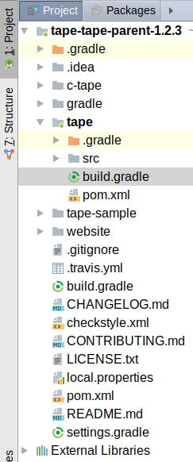
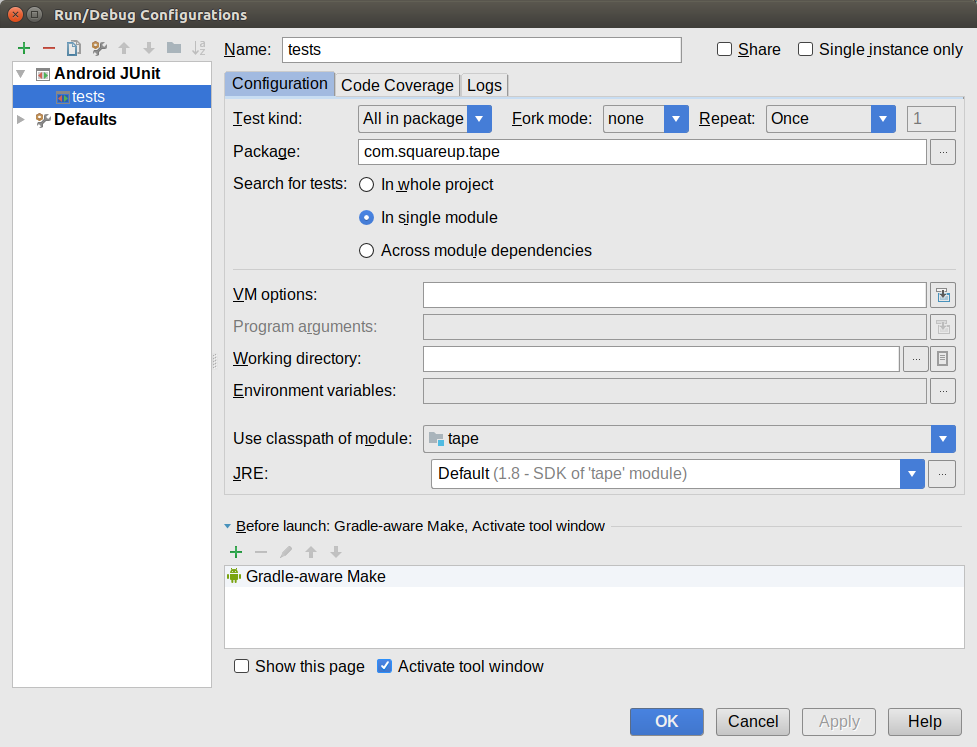
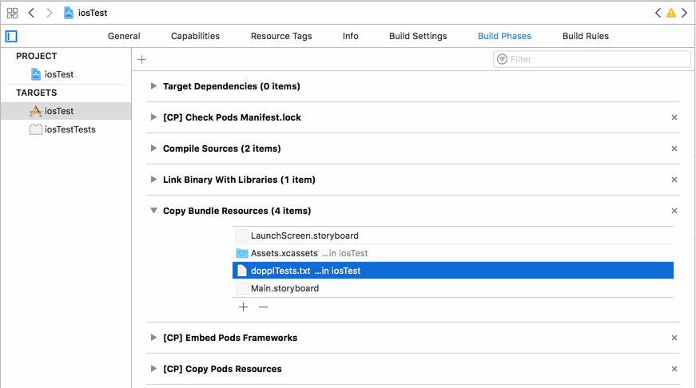
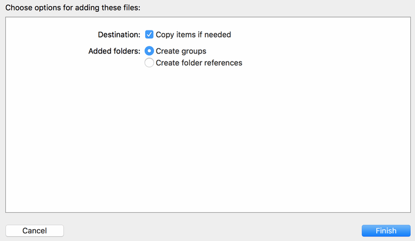
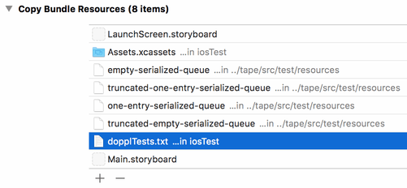

# Converting a Third-Party Library for Doppl

The [tutorial on converting a library module](./DopplLibrary) focused on converting
one of your library modules, for a project that has its code divided into
several modules. However, much of the time, the libraries that you are using
come from third parties, and those too need Doppl equivalents. Some of those
libraries have [Doppl equivalents maintained by the Doppl team](./Libraries).
Other times, you will need to convert the third-party library yourself. This
is more complicated than is converting your own library, as you will have less
experience with the code being converted and less control over how that code gets
implemented.

In this tutorial, we will convert an existing third-party library for use
with Doppl, to see how that process compares to that of
[converting one of your own library modules](./DopplLibrary).

## Prerequisites

The instructions in this tutorial assume that you have gone through
[the tutorial on converting a library module](./DopplLibrary), both for the
hands-on experience and for having a Doppl-ready development environment set up.

## The Tale of the Tape

The library that we will convert is [Tape](https://github.com/square/tape), from
Square. Tape has classes that implement a persistent FIFO queue. This can be
useful for maintaining work queues that can survive process termination, such
as commands representing network transactions to be performed on some future
server sync. Tape is a nice library for this tutorial:

- It has no UI components, and so is the sort of thing that would be a candidate
for conversion via Doppl, for any apps that are using Tape

- It has no production transitive dependencies, so we need to only convert
this one library, not some tree of libraries representing the entire dependency
graph

- It is licensed under
[the Apache Software License 2.0](https://github.com/square/tape/blob/master/LICENSE.txt),
which is friendly for modifications

## Step #1: Get the Third-Party Source Code

There are any number of possible version control strategies that you can use
when working on a Doppl conversion of a third-party library, such as:

- Fork the repository and work in branches on that fork

- Add a Git submodule pointing at the third-party repository

- Download a ZIP of the code, then integrate their code into your existing
version control system

Regardless of how you do it, you want to make sure that you are working with
the code that represents the specific version of the third-party library that
your app is using. If you are forking the repository, you can then create your
own branch starting with that specific version (e.g., use a tagged commit or a Git
hash). If you are just grabbing a ZIP archive with the code, you would want
to make sure that your ZIP is from the appropriate tagged version. And so on.

For the purposes of this tutorial, we will ignore version control, as we have no
idea what you might be using.

The particular version of Tape that we are going to convert is the one that was
the latest stable version as of November 2017: `tape-parent-1.2.3`. Download
[the ZIP archive for that tagged version](https://github.com/square/tape/archive/tape-parent-1.2.3.zip)
and unZIP it to some likely spot on your development machine. This will unpack
into an unfortunately-named `tape-tape-parent-1.2.3/` directory containing the
state of the Git repository as of the `tape-parent-1.2.3` tag.

## Step #2: Get Simplified Gradle Builds Working

The Tape project, for version 1.2.3, does not have Gradle build files. This is a
problem, as we need Gradle for Doppl. This will be a common problem with third-party
libraries, particularly those that either pre-date the release of Android Studio
or are pure-Java libraries with no particular ties to the Gradle build system.

In some cases, you can import the project into Android Studio, and it can create
Gradle build scripts for you. Android Studio does not recognize Tape's project
structure, though, and so it does not generate a very good Gradle setup.

Conversely, some projects may already have Gradle build scripts, but they have
lots of extra stuff that are important to the library developers but less important
to us. Examples include:

- Static code analyzers (e.g., `checkstyle`)
- Library publishing scripts (e.g., Bintray JCenter integration)
- Custom documentation generators

Your mission, when converting a third-party library, is to get it so that you
can build the library using Gradle, ideally with as lean of a Gradle build
script as possible. The details of this, from adding a Gradle script to cleaning
up an existing one, will vary widely between libraries.

For the purposes of Tape, we need to set up the Gradle build files ourselves,
including debugging how to get the basic library built and tests run. Fortunately,
what we care about resides in the `tape` module inside the `tape-tape-parent-1.2.3`
project directory. The other directories (`c-tape/`, `tape-sample/`, and `website/`)
can be skipped as they do not contain code that we care about. So, we need to get
this one module building and its unit tests running.

### Create `settings.gradle`

Inside the project root directory, create a `settings.gradle` file that identifies
our one-and-only module: `tape`:

```groovy
include ':tape'
```

### Create `gradle/wrapper/gradle-wrapper.properties`

Create a `gradle/wrapper/` directory tree inside the project root directory.
In there, create a `gradle-wrapper.properties` file, indicating that we are
using Gradle 4.1:

```
distributionBase=GRADLE_USER_HOME
distributionPath=wrapper/dists
zipStoreBase=GRADLE_USER_HOME
zipStorePath=wrapper/dists
distributionUrl=https\://services.gradle.org/distributions/gradle-4.1-all.zip
```

Alternatively, copy your `gradle/` directory from some project that is working
with Android Studio 3.0.x into the Tape project directory.

Note that if you wish to use the Gradle Wrapper to build this project &mdash;
instead of a local Gradle installation &mdash; you will also need the following
files from some project that is working with Android Studio 3.0.x:

- `gradle/wrapper/gradle-wrapper.jar`
- `gradlew`
- `gradlew.bat`

### Create `build.gradle`

In the project root directory, create a `build.gradle` file that sets up the
basics for using the Android Plugin for Gradle and defining our available
repositories:

```groovy
// Top-level build file where you can add configuration options common to all sub-projects/modules.

buildscript {
  repositories {
    jcenter()
    google()
  }
  dependencies {
    classpath 'com.android.tools.build:gradle:3.0.1'
  }
}

allprojects {
  repositories {
    jcenter()
    google()
  }
}

task clean(type: Delete) {
  delete rootProject.buildDir
}
```

Alternatively, copy the project-level `build.gradle` file from an existing
project that is working with Android Studio 3.0.x.

### Create `tape/build.gradle`

In the `tape/` module directory, create a `build.gradle` file that declares
the project as being a plain Java module:

```groovy
apply plugin: 'java'

sourceCompatibility = 1.8
targetCompatibility = 1.8
```

### Import the Project Into Android Studio

At this point, you should be able to import the project cleanly into Android
Studio 3.0.x, via File > New > Import Project. The resulting IDE window
should show the `tape` module in bold in the project tree:



### Add the Dependencies

One thing that is missing from the `build.gradle` file in the `tape` module
is any indication of the dependencies used by this module. To determine what
our dependencies need to be, we need to poke around two `pom.xml` files.

The first is the one in the `tape` module:

```xml
<?xml version="1.0" encoding="UTF-8"?>

<project xmlns="http://maven.apache.org/POM/4.0.0" xmlns:xsi="http://www.w3.org/2001/XMLSchema-instance" xsi:schemaLocation="http://maven.apache.org/POM/4.0.0 http://maven.apache.org/maven-v4_0_0.xsd">
  <modelVersion>4.0.0</modelVersion>

  <parent>
    <groupId>com.squareup</groupId>
    <artifactId>tape-parent</artifactId>
    <version>1.2.3</version>
    <relativePath>../pom.xml</relativePath>
  </parent>

  <name>Tape</name>
  <artifactId>tape</artifactId>

  <dependencies>
    <dependency>
      <groupId>junit</groupId>
      <artifactId>junit</artifactId>
      <scope>test</scope>
    </dependency>
    <dependency>
      <groupId>org.mockito</groupId>
      <artifactId>mockito-core</artifactId>
      <scope>test</scope>
    </dependency>
    <dependency>
      <groupId>org.easytesting</groupId>
      <artifactId>fest-assert</artifactId>
      <scope>test</scope>
    </dependency>
    <dependency>
      <groupId>commons-io</groupId>
      <artifactId>commons-io</artifactId>
      <scope>test</scope>
    </dependency>
  </dependencies>
</project>
```

Here, you see four `test` dependencies listed:

- `junit:junit`
- `org.mockito:mockito-core`
- `org.easytesting:fest-assert`
- `commons-io:commons-io`

However, no version information appears here. That is held in the `pom.xml`
file up in the project root directory, in the `<properties>` element:

```xml
  <properties>
    <project.build.sourceEncoding>UTF-8</project.build.sourceEncoding>

    <android.version>4.1.1.4</android.version>
    <android.platform>16</android.platform>
    <http-request.version>2.2</http-request.version>
    <dagger.version>0.9</dagger.version>
    <otto.version>1.3.1</otto.version>
    <gson.version>2.2</gson.version>
    <junit.version>4.10</junit.version>
    <fest.version>1.4</fest.version>
    <commons-io.version>2.4</commons-io.version>
    <mockito.version>1.9.5</mockito.version>
  </properties>
```

However, Android Studio 3.0.1 needs JUnit 4.12, not 4.10, to be able to successfully
run the unit tests. So, we need to upgrade that dependency and hope for the best.

With that, we have the information necessary to create the `dependencies`
closure in the `tape/build.gradle` file:

```groovy
dependencies {
  testImplementation "junit:junit:4.12"
  testImplementation "org.mockito:mockito-core:1.9.5"
  testImplementation "org.easytesting:fest-assert:1.4"
  testImplementation "commons-io:commons-io:2.4"
}
```

If you add that closure to `tape/build.gradle` and look at the Java source
in the `test` source set, you will see that all come up with no errors. Prior
to adding the `dependencies`, those Java source files would have been riddled
with compile errors, for all of the missing dependencies.

### Add a Pointless App Module

Android Studio 3.0.1 [has a bug](https://issuetracker.google.com/issues/69669750)
that prevents it from running unit tests of a Java module unless there is an
`app` module also in the project.

So, use File > New > New Module from the Android Studio main menu to add
a "Phone & Tablet Module" to the project. Have the "Module name" be `app`, but
the rest of the settings for this module do not seem to matter.

### Try the Tests

Choose Run > Edit Configurations from the Android Studio main menu. Click
the green + toolbar button in the "Run/Debug Configurations" dialog, and choose
"Android JUnit" from the drop-down menu. There, change the settings to:

|Configuration Item|Value|
|:----------------:|:---:|
|Name              |`tests`
|Test kind         |All in package
|Package           |`com.squareup.tape`
|Search for tests  |In single module
|Use classpath of module|`tape`

The remaining items can either be left at their defaults or set to whatever
is needed for your development environment.



Click OK to close the dialog, then run the "tests" configuration. You should
see that all 29 tests pass.

## Step #3: Add the Doppl Gradle Basics

With all that behind us, we can now move ahead into configuring Doppl to convert
this library.

First, we need to do some of the basics from previous tutorials:

- Add `j2objc.home` to `local.properties`

- Modify the project-level `build.gradle` to have `maven { url 'https://dl.bintray.com/doppllib/maven2' }`
in both `repositories` closures and have `classpath 'co.doppl:gradle:0.10.7'`
in the `dependencies` closure (alongside the existing Android Plugin for Gradle
statement)

- Modify `tape/build.gradle` to add `apply plugin: 'co.doppl.gradle'`

That is boilerplate and does not really differ between libraries that you might
want to convert using Doppl.

## Step #4: Configure Doppl and Dependencies

We know from past tutorials that we also need to add a `dopplConfig` closure
(to configure Doppl) and add `doppl` and `testDoppl` dependencies to our
module's `build.gradle` file.

The basic `dopplConfig` setup uses `translatePattern` to indicate all of the
classes (production and test) that need to be converted, plus `testIdentifier`
to point out the classes containing JUnit-based unit tests. If you examine
the `main` and `test` source sets in the `tape` module, you will see that
all of the Java classes are in `com.squareup.tape`, and that the unit tests
are in classes whose names end in `Test`. While there is a `QueueTestUtils` class
in the `test` source set, it does not contain actual unit tests, but rather
utility code used by other test classes. Hence, `QueueTestUtils` is not part
of our `testIdentifier`.

So, we can try having this `dopplConfig` closure in `tape/build.gradle`:

```groovy
dopplConfig {
  translatePattern {
    include 'com/squareup/tape/**'
  }

  testIdentifier {
    include 'com/squareup/tape/*Test.java'
  }
}
```

Note that we skip `javaDebug true` here. If you feel that you would need to
perhaps step through Tape code, you could enable `javaDebug`. Typically, we do
not need to step through third-party code, and adding `javaDebug` does add a
bit of overhead to the build process.

In terms of dependencies, we have no production dependencies, but we do have
four test dependencies:

```groovy
dependencies {
  testImplementation "junit:junit:4.12"
  testImplementation "org.mockito:mockito-core:1.9.5"
  testImplementation "org.easytesting:fest-assert:1.4"
  testImplementation "commons-io:commons-io:2.4"
}
```

From past tutorials, we have seen that our Doppl-modified project would replace
that `junit:junit` dependency statement with:

```groovy
  testImplementation  "junit:junit:4.12"
  testDoppl           "co.doppl.junit:junit:4.12.0"
  testImplementation  "co.doppl.lib:androidbasetest:0.8.8"
  testDoppl           "co.doppl.lib:androidbasetest:0.8.8.0"
```

Similarly, the `org.mockito:mockito` dependency would turn into:

```groovy
  testImplementation  "org.mockito:mockito-core:1.9.5"
  testDoppl           "co.doppl.org.mockito:mockito-core:1.9.5.0"
```

The other two dependencies are not among those listed in
[the roster of supported Doppl libraries](./Libraries). That means we have
two choices:

1. Convert those libraries ourselves

2. Remove those libraries and any Java code that relies upon them

In this case, we will go with the latter option. If these were production
dependencies, rather than test ones, we might elect to go with the former
option, particularly if those libraries are used in many places in the code.

So, with that in mind, modify the `dependencies` closure to have the Doppl-specific
dependencies plus Mockito, but eliminate the others. That should give you a
`tape/build.gradle` file that looks like:

```groovy
apply plugin: 'java'
apply plugin: 'co.doppl.gradle'

sourceCompatibility = 1.8
targetCompatibility = 1.8

dependencies {
  testImplementation  "junit:junit:4.12"
  testDoppl           "co.doppl.junit:junit:4.12.0"
  testImplementation  "org.mockito:mockito-core:1.9.5"
  testDoppl           "co.doppl.org.mockito:mockito-core:1.9.5.0"
  testImplementation  "co.doppl.lib:androidbasetest:0.8.8"
  testDoppl           "co.doppl.lib:androidbasetest:0.8.8.0"
}

dopplConfig {
  translatePattern {
    include 'com/squareup/tape/**'
  }

  testIdentifier {
    include 'com/squareup/tape/*Test.java'
  }
}
```

## Step #5: Fix the Tests

Given that we eliminated the `org.easytesting:fest-assert` and
`commons-io:commons-io` dependencies, we will have a bunch of compile errors
in our unit tests. If you examine the Java classes in the `test` source set,
you will see that only two of the four classes have compile errors: `QueueTestUtils`
and `QueueFileTest`. We need to adjust these classes to no longer need those
removed dependencies.

The errors in `QueueTestUtils` are tied to `commons-io`. `QueueTestUtils`
uses `FileUtils.copyInputStreamToFile()`, and so the `import` for `FileUtils`
and that method call both result in compile errors. Since `commons-io` is
open source under a friendly license, we could copy
[the code from version 2.4 of `FileUtils.java`](https://github.com/apache/commons-io/blob/2.4/src/main/java/org/apache/commons/io/FileUtils.java#L1508-L1520).
However, that code in turn relies on an `IOUtils` class, and we run the risk
of having a lot more code to convert. Besides, copying an `InputStream`
to a `File` is not especially difficult code to write. So, modify `QueueTestUtils`
to remove the `import` of `FileUtils` and replace the call to 
`FileUtils.copyInputStreamToFile()` with a call to a locally-defined
`copyInputStreamToFile()` method:

```java
  static private void copyInputStreamToFile(InputStream in, File dst) throws IOException {
    FileOutputStream out=new FileOutputStream(dst);
    byte[] buf=new byte[1024];
    int len;

    while ((len=in.read(buf)) > 0) {
      out.write(buf, 0, len);
    }

    in.close();
    out.close();
  }
```

That was easy. However, a glance at `QueueFileTest` shows a *lot* of compile errors,
which may cause you to become concerned at the amount of work needed to fix this
up. Fortunately, it's not that bad.

If you look at the `import` statements, the three that are missing are
all from FEST:

```java
import org.fest.assertions.Assertions;
import static org.fest.assertions.Assertions.assertThat;
import static org.fest.assertions.Fail.fail;
```

Replacing `import static org.fest.assertions.Fail.fail;` with
`import static org.junit.Assert.fail;` is quick, easy, and clears up a small
number of the errors.

A quick search of the code shows that the only places where `Assertions`
is referenced is in the remaining failing `static` import and one line of code,
where the static import of `assertThat()` is not being used (line #277):

```java
Assertions.assertThat(queueFile.size()).isEqualTo(2);
```

Replace the `Assertions.assertThat()` line shown above with:

```java
assertEquals(queueFile.size(), 2);
```

Then, you can remove the import for `org.fest.assertions.Assertions`, as it is
unused.

All the remaining errors come from uses of `assertThat()`. These need to be
replaced with native JUnit equivalents:

|FEST Structure|JUnit Equivalent Structure|
|:------------:|:------------------------:|
|`assertThat(...).isEqualTo(...)`, where `...` is an array|`assertArrayEquals(..., ...)`
|`assertThat(...).isTrue()`|`assertTrue(...)`
|`assertThat(...).isNull()`|`assertNull()`
|`assertThat(...).hasMessage(...)`|`assertEquals(..., ...)`
|`assertThat(...).isEqualTo(...)`|`assertEquals(..., ...)`
|`assertThat(...).isEqualTo(...).as("msg")`|`assertEquals("msg", ..., ...)`

These will require further `static` imports, for `assertArrayEquals()`, `assertTrue()`,
`assertNull()`, and `assertEquals()`.

There is an `assertThat().hasMessage()` statement (line #141):

```java
assertThat(ex).hasMessage("File is corrupt; length stored in header is 0.");
```

This confirms that the exception message contains the listed string.
This can be converted to:

```java
assertTrue(ex.getMessage().contains("File is corrupt; length stored in header is 0."));
```

The only ones that are not boilerplate conversions are two `assertThat().containsOnly()`
statements (lines #624 and 632):

```java
assertThat(data).containsOnly((byte) 0x00);
```

`containsOnly()` confirms that all elements of the `data` array are the
supplied value. You can add this replacement method:

```java
static void assertContainsOnly(byte[] data, byte value) {
  for (byte datum : data) {
    assertEquals(datum, value);
  }
}
```

Then, convert those two error lines to:

```java
assertContainsOnly(data, (byte) 0x00);
```

Finally, remove the import for `org.fest.assertions.Assertions.assertThat`, as
it is unused.

After these changes, your tests should run once again, but this time without
the extra test dependencies.

## Step #6: Test on iOS

At this point, you can get the tests running on iOS following the same recipe
as outlined in the previous tutorials:

- Create an empty Xcode project (referred to here as `iosTest`) in the
`tape-tape-parent-1.2.3` project directory 

- Create a `Podfile` in the Xcode project directory, where the `target` value
is the name of the project (`iosTest`) and the `:path` points to
`../tape`

```ruby
platform :ios, '9.0'

install! 'cocoapods', :deterministic_uuids => false

target 'iosTest' do
    use_frameworks!
    pod 'testdoppllib', :path => '../tape'
end
```

- Run the `dopplBuild` Gradle task for the `:tape` module,
which should run cleanly and create your pods

- Run `pod install` in the `iosTest/` directory

- Open the Xcode workspace file created by `pod install` and run it

- Copy the `dopplTests.txt` file out of `tape/build/` into
the `iosTest` folder in Xcode

- Add the `import testdoppllib` and `DopplRuntime.start()` statements to
`AppDelegate`

- Add the `import testdoppllib` and
`CoTouchlabDopplTestingDopplJunitTestHelper.runResource(with: "dopplTests.txt")`
statements to `ViewController`

However, there is one thing that we need to do above and beyond that, because
the `test` source set not only has Java code, but Java resources as well.
J2objc supports Java resources, but Doppl does not automatically package them
in any way that Cocoapods or Xcode will pick up. We have to add them manually
to the `iosTest` project.

To do that:

- Click on the root `iosTest` in the project tree in Xcode

- Click on "Build Phases" in the set of tabs in the main editing pane

- Fold open "Copy Bundle Resources"



- In Finder, go to the `tape/src/test/resources/` directory, find the
four `.queue` files in there, and drag them into the list of files in
the "Copy Bundle Resources" area

- In the resulting dialog, make sure that "Copy items if needed" is checked
and choose "Create groups if needed"



- Click Finish on the dialog, and your four resources will be copied into
the project



Now, when you run the project, your tests should succeed.

At this point, if you wanted, you could follow the steps in
[the general library tutorial](./DopplLibrary) to publish this library
as an artifact in a repository somewhere, for other apps to use.
