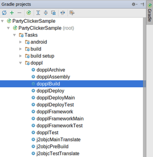
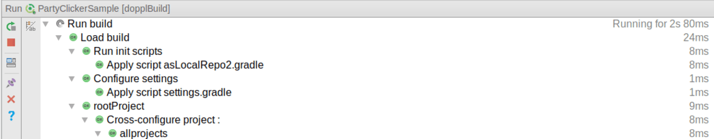
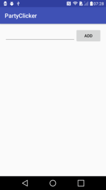
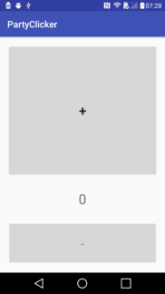
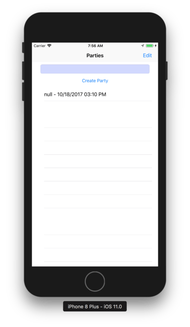
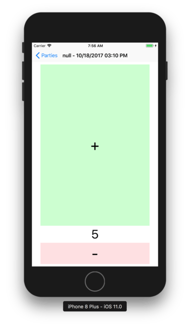

# Doppl in Ten Minutes for Android Developers

Seeing Doppl in action, using a prepared app, is fairly straightforward. If you
have an Android and iOS development environment set up, and you have a robust
Internet connection, it could take you as little as ten minutes.

So... let's get started!

## Introducing the Sample App

The app that we will be using is a "party clicker". It allows you to define
events and, for each, keep track of how many people are presently attending the
party. The "clicker" aspect is represented by a pair of buttons that allow you
to increment or decrement the current number of attendees. The idea is that
somebody at the door is "clicking" as people come and go.

The sample app consists of three main pieces:

- A complete Android app, with all of the needed functionality

- A test suite, to illustrate how tests get converted by Doppl

- A Swift-based UI for the iOS app

What the sample app lacks, out of the box, is an iOS implementation of the logic
behind the UI, such as storing the events and their attendee counts somewhere.
That sort of business logic is what Doppl can convert for you, and the Android
app has the Doppl configuration to perform that conversion.

By following this tutorial, you will set up Doppl on your development machine,
convert the needed Android code to iOS code, and run the resulting iOS app.
Plus, Doppl will convert the test suite as well, and you will be able to run
it to test the iOS code conversion.

## Prerequisites

For the purposes of this tutorial, it is simplest if you have a development
machine, running macOS, that is set up for both Android and iOS development.
That is not strictly required: while iOS development requires macOS, Android
development, including Doppl, can be done on macOS, Windows, or Linux.
If you wish to use two separate machines, one for the Android side and one
for the iOS side, that is possible, but you will need to copy the project
from the Android machine to the iOS machine part-way through the tutorial.

Beyond that, here is the development machine setup that these instructions
expect.

### Android

At minimum, you need a JDK. While Android Studio comes with its own JDK, that
is not set up for command-line use outside of Android Studio. However, Doppl
does need the ability to use the JDK commands, like `javac`, from the command
line. The simplest solution is to have a separate copy of the JDK set up, following
the conventions for your development machine's OS, such that you can run `javac`
successfully from the command line.

Doppl does not require Android Studio. However, you are welcome to use it
as well. These instructions work with Android Studio 2.3.3 and Android Studio
3.0.

### iOS

You need to have Xcode set up on the iOS development machine. These instructions
are created for Xcode 9.

In addition, you
need to install [Cocoapods](https://cocoapods.org/), if you have not done so
already for other reasons.

### General

The tutorial instructions were written with developers in mind that already
know how to use GitHub, in terms of cloning a repository or downloading a
ZIP archive of a project's code.

## Step #1: Set Up the Doppl Runtime

Visit [the download page](http://doppl.co/download.html) and download the latest
Doppl runtime. Note that this is a rather large ZIP file (over 1GB), so plan
accordingly.

Then, unZIP its contents into some new directory somewhere on your development
machine. The exact location does not matter, but you will need to enter its
path into a couple of spots (e.g., a `local.properties`) file.

Note that if you are using different machines for Android development and iOS
development, *both* machines need the Doppl runtime.

## Step #2: Clone the Sample App

The sample app is in [a GitHub repository](https://github.com/doppllib/PartyClickerSample).
Either clone the repository using `git clone` or download the ZIP archive
for the sample app and unZIP it somewhere on your Android development machine.

## Step #3: Add local.properties

In the root of the sample project, you will find a bunch of standard Android
development files, such as `build.gradle`, `settings.gradle`, and so forth.
You will *not* find a `local.properties` file, and we need to add one, to tell
the build process where your Doppl runtime resides.

So, add a new `local.properties` file to the project root directory, or open
the existing one if it is there (e.g., you imported the project into Android Studio).
In there, add a `j2objc.home` property, whose value is the fully-qualified path to
where you set up the Doppl runtime:

```groovy
j2objc.home=...
```

(where the `...` is replaced by your path to the Doppl directory)

Here, `j2objc` refers to
[Google's Java-to-Objective-C translator](https://developers.google.com/j2objc/),
which is a key part of the Doppl environment.

<iframe width="560" height="315" src="https://www.youtube.com/embed/H95OKwQ_9FU" frameborder="0" allowfullscreen></iframe>

## Step #4: Run the dopplBuild Task

The Doppl magic comes in the form of a `dopplBuild` Gradle task, added via
a Doppl plugin that our sample app uses. You need to run this task to have
Doppl perform the Android-to-iOS code conversion.

### ...From Android Studio

From inside of Android Studio, you will find the `dopplBuild` task in the
Gradle tool, in the `doppl` category under the project root:



Double-click on that entry to run the task:



### ...From the Command Line

If you prefer, run the `dopplBuild` task from the command line, from the
project root directory, using `gradle` (if you have a compatible version
of Gradle installed) or `./gradlew` (if you prefer to use the Gradle Wrapper).

## Step #5: Get the Output to the iOS Development Machine

At this point, if your Android development machine is separate from
your iOS development machine, copy the `PartyClickerSample/` directory
from the Android machine to the iOS machine, including all of the output
that Doppl generated. If both machines have access to the same working
directory (e.g., on a file server), or if you have one machine for both
Android and iOS development, you can skip that step.

## Step #6: Set Up the Cocoapods

From the command line in your iOS development machine, switch to the `iosApp/`
directory inside the `PartyClickerSample/` directory. From there, run `pod install`,
to set up the iOS dependencies using CocoaPods.

Then, switch to the `iosTest/` directory inside the `PartyClickerSample/` directory.
From there, once again, run `pod install`, to set up the iOS dependencies using CocoaPods.

## Step #7: Teaching Xcode About Doppl

Just as we set up `local.properties` to let the Android toolchain know about
Doppl, we need to perform a similar step to teach Xcode about Doppl.

Go to Xcode > Preferences > Locations, then click on Custom Paths. There,
add a new custom path via the + button, with the following values:

- Name = `J2OBJC_LOCAL_PATH`
- Display Name = `J2OBJC_LOCAL_PATH`
- Path = `...`

(where `...` is replaced by the fully-qualified path to the Doppl runtime
directory on this machine)


<iframe width="560" height="315" src="https://www.youtube.com/embed/swLXzvIOm9A" frameborder="0" allowfullscreen></iframe>

## Step #8: Running the Sample App

At this point, not only is the app ready to run in Android Studio, but you can
run it in Xcode as well!

### ...In Android Studio

Running the sample app on a device or emulator gives you a basic UI for defining
events and capturing clicks:





### ...In Xcode

If you open the `iosApp/` workspace in Xcode and run it on a device or simulator,
you will see an custom equivalent iOS UI, working with the Doppl-supplied model
objects and storage code:





## Step #9: Running the Tests

The Android project contains unit tests. These tests get converted by Doppl,
just as the rest of the non-UI code gets converted by Doppl. The result is a
set of tests that you can run in Xcode to confirm that the code conversion
worked as expected.

Simply open the `iosTest/` workspace in Xcode and run it. The device or
simulator will show no output, but the output console will show the number
of tests found and the number of failures, which should be 0.
