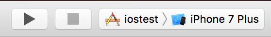

# Party Clicker Tutorial

For a quick intro to how Doppl works, try this [simple tutorial app](https://github.com/doppllib/PartyClickerSample). We'll walk you through the steps to get set up and running, and explain a few concepts along the way.

## Video

Who reads? Watch the setup video.

<iframe width="560" height="315" src="https://www.youtube.com/embed/8T6EQAzZxCo" frameborder="0" allowfullscreen></iframe>

## Requirements

1. A Mac OSX PC, with a few gigs of free drive space
2. Android Studio
3. Xcode

## Install J2objc

Doppl is based on [J2objc](https://developers.google.com/j2objc/), which converts Java to Objective-C. Doppl is **almost** stock J2objc, but has some local tweaks, which means we have to distribute our own slightly altered version. The changes are mostly about file organization, rather than anything with the runtime. [Read more here](dopplj2objc.html).

Download the [Doppl J2objc Runtime](/download.html), and extract the zip file to your local drive. This is your **j2objc dist** directory.

## Get the Sample

Clone [the sample app](https://github.com/doppllib/PartyClickerSample).

<pre class="command-line" data-user="you" data-host="yourmac"><code class="language-bash">
git clone https://github.com/doppllib/PartyClickerSample.git</code></pre>

Open the sample app in Android Studio.

**Note** *If you're not an Android developer, that means go to File > Open, then open the PartyClickerSample directory. There is no project or "workspace" file to open.*

<iframe width="560" height="315" src="https://www.youtube.com/embed/vPxrCyFTqJk" frameborder="0" allowfullscreen></iframe>

### Configure Android Studio

Edit the local.properties file. If it doesn't exist, create it in your project root. Add a property point to your **j2objc dist**

```groovy
j2objc.home=[j2objc dist]
```

If you're having trouble finding local.properties, watch the video:

<iframe width="560" height="315" src="https://www.youtube.com/embed/H95OKwQ_9FU" frameborder="0" allowfullscreen></iframe>

Assuming you have a device or emulator to test on, you should be able to run the Android app at this point.

### Configure Xcode

Xcode also needs to know where J2objc is installed. Open XCode > Preferences, Locations > Custom Paths. Add 'J2OBJC_LOCAL_PATH' and set Path to **j2objc dist** (no trailing slash).

<iframe width="560" height="315" src="https://www.youtube.com/embed/swLXzvIOm9A" frameborder="0" allowfullscreen></iframe>

Various settings in the project use this property to point to J2objc, and if set up properly, your project should be portable among developers with different local drive location configurations. See [Xcode Setup](xcodesetup.html) for more details.

## Run Sample

Assuming everything is set up correctly, you should be able to navigate to the `ios` folder, open the project, and run it on an iPhone simulator. Make sure you have the `ios` application target set with a valid simulator.

<iframe width="560" height="315" src="https://www.youtube.com/embed/gFXQjVsu2b8" frameborder="0" allowfullscreen></iframe>

If the sample doesn't run, something in the setup isn't working. Retrace steps and/or watch the [full demo video](#video).

# The Parts

Back in Android Studio, find the root directory **build.gradle** file. This contains references to our artifact repo, which will eventually move to jcenter, and the classpath to the Doppl Gradle plugin.

<pre class="language-groovy" data-src="https://raw.githubusercontent.com/doppllib/PartyClickerSample/master/build.gradle" ></pre>
**[root]/build.gradle**

The app's **build.gradle** is set up like most Android applications, with a few additions.

[2-3](#appbuild.2): Apply retrolambda and Doppl plugins

[28-53](#appbuild.28): Project dependencies. Notice parallel `doppl` and `testDoppl` dependencies (Doppl is for [Doppelgänger](https://en.wikipedia.org/wiki/Doppelg%C3%A4nger))

[57-58](#appbuild.57): Where to copy Objective-C to. Can be multiple for each type.

[60](#appbuild.60): Generate bridging headers for Swift, if desired.

[64-67](#appbuild.64): Shorten prefixes. More detail [here](packageprefixes.html).

[69](#appbuild.69): testAnnotationProcessor doesn't advertise it's output dir, so you need to specify.

[71-76](#appbuild.71): Tell Doppl what to translate

<pre id="appbuild" class="language-groovy line-numbers" data-line="2-3,28-53,57-58,60,64-67,69,71-76" data-src="https://raw.githubusercontent.com/doppllib/PartyClickerSample/master/app/build.gradle" ></pre>

## Running Tests

Currently the iOS app itself and the iOS JUnit tests are in different Xcode projects. They don't need to be, but for ease of organization, they were split out.

J2objc ships with JUnit. Doppl has some helper classes and Gradle task support to help setting this up. How all that works is a [longer topic](debugging.html#testing), but you can open and run the test project to see how it works.

Find the `iostest` folder in the root folder of the sample project. Open the Xcode project in that folder. Verify that you have the 'iostest' target and a valid simulator selected in Xcode.



In the top menu, click `Product > Test`. This will probably take a while but will run a single XCTest that runs the set of JUnit tests.

Also notice at the bottom of the app's `build.gradle` file, there's an Exec task called [runIOSTests](#appbuild.79). It can run the iOS unit tests from gradle, if you're looking to automate things.

## Modifying Java Code

The shared code in the project is flagged with the `translatePattern` file pattern in build.gradle. Any code that matches that pattern will be pushed through J2objc and output to the folders specified `copyMainOutput` or `copyMainOutput`. To trigger the J2objc code transform run

<pre class="command-line" data-user="you" data-host="yourmac"><code class="language-bash">
./gradlew dopplDeploy</code></pre>

Assuming no errors, this will push code changes to the ios project(s).

## Dealing with Xcode

If you add or remove Java code files, Xcode will need to know about the new code. This is just one of those things you need to get used to, or try some alternate project structure. See [here](workingwithxcode.html) for more info.

## Quick Tour of Code

### Java Side

The Android application starts up with a custom Application class that initializes code for the shared library. `PartyClickerApplication` passes in itself, the Context, and a Dagger component. This will be referenced from the shared code. The iOS side with do a similar things in it's AppDelegate.

The `data` package contains database definition and management code. The `presenter` package contains presenter logic, as well as Dagger definitions and other interfaces. These packages are both fully shared to iOS. You should also note that code generated with annotation processing is found in `[root]/app/build/generated/source/apt/debug`. This code is also converted during `dopplDeploy`.

Shared code communicates with platform specific code by way of interfaces (in this case. You could do a more reactive model). An interface representing the UI is defined in both `PartyListPresenter` and `PartyPresenter`. On the Android side, these are implemented by `PartyListActivity` and `PartyActivity` respectively.

### Xcode Side

The UI code for the sample app is written in Swift. The entry point for the application is `AppDelegate.swift`.

```swift
func application(_ application: UIApplication, didFinishLaunchingWithOptions launchOptions: [UIApplicationLaunchOptionsKey: Any]?) -> Bool {

    DopplRuntime.start()

    let context = AndroidContentIOSContext()
    let appModule = PPAppModule(androidAppApplication: context, with: PPLogCrashReporter())

    PAppManager.init__(with: context, with: PPDaggerDaggerComponent.builder()
        .appModule(with: appModule).build())

    // Override point for customization after application launch.
    return true
}
```

It creates the iOS version of the Android Context, as well as initializes the Dagger component, just like `PartyClickerApplication`.

Note one small but very important detail. `DopplRuntime.start()`. This app uses Doppl's extended Android runtime support, which includes attaching to the main thread, and some static data initialization. This is handled in `DopplRuntime`.

As with Android, we implement the presenter UI interfaces in `PartyListViewController` and `PartyViewController`.

## What's Shared?

Although there are some duplicate artifacts (`PartyListActivity` and `PartyListViewController`, for example), you'll notice that there's not a lot of duplicate *logic*. The code in these classes is wiring the shared logic to the actual UI. If you're familiar with mobile development, you'll notice that pretty much everything that's considered "logic" is shared. This includes main/background thread changes and SQLite database management. Were this a more complex example, that could include networking, Shared preferences, local files, and much more.

When something needs to be platform specific, creating a shared interface and implementing that on both platforms is, although perhaps verbose, simple. For example, the `CrashReporter` interface can be used extensively in the shared code, and in a live app, is intended to be implemented by each platforms specific library. There may be some delegate boilerplate involved, but again no real "logic".

The goal of Doppl is to be able to push the level of what **can** be shared as far as is reasonable, but to allow the developer to decide what **will** be shared and to allow that line to be drawn in a natural and uncomplicated way.

# What's Next?

[List of available libraries](librarystatus.html)

[Roadmap](roadmap.html)
